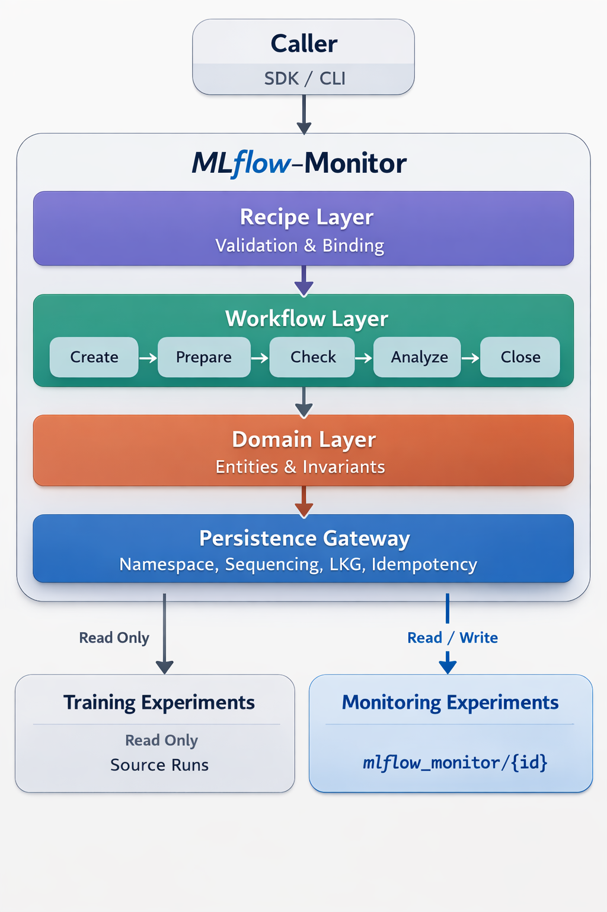

# MLflow-Monitor

Baseline-aware model monitoring on top of MLflow.

MLflow-Monitor reads existing MLflow training runs, checks whether they are comparable to a trusted baseline, and stores monitoring state in a separate MLflow namespace. Training runs stay read-only; monitoring history gets its own timeline.

<p align="center">
  
</p>

## What It Adds Beyond MLflow

MLflow already tracks training runs, metrics, params, tags, and artifacts. MLflow-Monitor adds:

- baseline pinning for a monitored subject
- comparability checks before metric interpretation
- timeline-aware monitoring runs
- separate persisted monitoring state and result artifacts

This makes it possible to answer questions like:

- Is this run comparable to the baseline?
- Which run is the baseline for this subject?
- What happened on the last monitoring attempt?

## Current Status

The current shipped workflow covers synchronous monitoring through create, prepare, and check:

- first run bootstrap with an explicit baseline
- later runs that reuse the pinned baseline
- comparability outcomes of `pass`, `warn`, and `fail`
- persisted monitoring runs and `outputs/result.json` artifacts in MLflow

Later workflow stages are not part of the current runtime yet.

## Try It

The fastest way to see the system working is the repo-level fraud demo:

```bash
uv sync --extra demo
uv run demo/setup.py
```

Then follow the walkthrough in [demo/README.md](demo/README.md).

## Architecture And Concepts

For a deeper explanation of the system:

- see [docs/architecture.md](docs/architecture.md) for structure and runtime boundaries
- see [docs/worldview.md](docs/worldview.md) for the core concepts and design philosophy

## Python SDK

```python
from mlflow_monitor import monitor

result = monitor.run(
    subject_id="fraud_model",
    source_run_id="training_run_id",
    baseline_source_run_id="baseline_run_id",
)

print(result.lifecycle_status)
print(result.comparability_status)
```

## License

Apache-2.0
