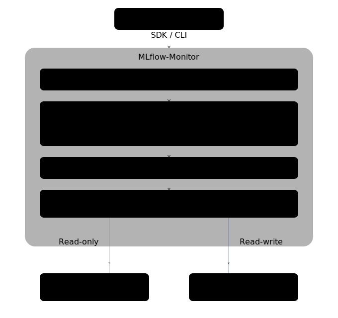

# MLflow-Monitor

**Baseline-aware model performance monitoring for MLflow.**

MLflow-Monitor reads your existing MLflow training experiments, compares model performance against baselines and contracts, and tells you what changed, whether it matters, and what to do about it — without modifying your training runs or requiring additional infrastructure.

```python
from mlflow_monitor import monitor

result = monitor.run(subject_id="churn_model")

print(result.status)        # pass / warn / fail
print(result.findings)      # what changed and what to do
```

## The Problem

You track experiments in MLflow. You have dozens (or hundreds) of training runs. But when someone asks "is this model better than what we had before?" — the answer is a notebook someone wrote last quarter, a Slack thread, or gut feeling.

Common failure modes:

* **No stable baseline.** You're comparing against... something. The reference drifts. Nobody remembers which run was "the good one."

* **Invalid comparisons go unnoticed.** The feature set changed. The data scope shifted. The environment is different. But the metrics still look like numbers, so people draw conclusions anyway.

* **Metric deltas without context.** Accuracy dropped 2%. Is that a problem? Compared to what? Since when? At what severity? Nobody knows without digging.

* **Throwaway monitoring scripts.** Every team writes their own comparison logic. It lives in a notebook. It breaks when someone changes the training pipeline. There's no audit trail.

## What MLflow-Monitor Does

MLflow-Monitor adds structure to the monitoring gap between "we trained a model" and "we should promote it."

**Comparability checking.** Before comparing any metrics, the system verifies the runs are actually comparable. Schema mismatches, feature set changes, data scope differences — caught before anyone draws wrong conclusions. Environment mismatches (different library versions) are flagged as warnings, not silent failures.

**Structured diffs.** Every run is compared against up to three references: the original baseline (long-term drift), the previous run (iteration-to-iteration), and the last known good run (gap from trusted state). You see exactly what changed and against what.

**Actionable findings.** Diffs are evidence. Findings are interpretation. MLflow-Monitor separates the two — each finding has severity, category, and a link back to the supporting diffs. You get "what to do" on top of "what changed."

**Timeline tracking.** Model performance is a trajectory, not a snapshot. MLflow-Monitor maintains an ordered timeline of monitoring runs per subject, with anchor-window queries that let you view performance from any point forward.

**LKG promotion.** Designate your best run as "Last Known Good" — a trust marker that subsequent runs are compared against. Aligns with MLflow's model promotion concept: monitoring exists to answer "is this good enough to promote?"

## How It Works

```
Your training pipeline          MLflow-Monitor                  MLflow
─────────────────────          ──────────────                  ──────
                                                                
Train model ──────────────> Log to MLflow ─────────────> Training experiment
                                                         (never modified)
                                    │
                                    │  monitor.run("churn_model")
                                    │
                                    ▼
                            Read source run ◄────────── Training experiment
                            Check comparability
                            Compute diffs
                            Generate findings
                            Persist results ──────────> mlflow_monitor/churn_model
                                    │                   (system-owned)
                                    │
                                    ▼
                            Return result to caller
```

MLflow-Monitor reads from your training experiments and writes to its own namespace. Your training data is never touched.

## Key Design Decisions

**Zero config to start.** Install, point at a subject, run. The default recipe reads whatever metrics, params, and tags your training runs already have. No schema files, no config files, no setup ceremony. Add precision later with custom recipes and contracts.

**No new infrastructure.** MLflow-Monitor uses your existing MLflow instance as its storage backend. No database to deploy, no service to run. It's a library you call from a script, notebook, or CI pipeline.

**Training runs are sacred.** MLflow-Monitor never writes to, modifies, or appends to your training runs. Teams trust their MLflow experiment history — that trust is never broken.

**System-owned naming.** Monitoring experiments live under a deterministic namespace (`mlflow_monitor/{subject_id}` by default). No naming conventions to enforce, no experiments proliferating with inconsistent suffixes. Given a subject ID, anyone can find its monitoring history.

**Configurable namespace.** Teams sharing an MLflow instance can configure different namespace prefixes to avoid collisions.

## Quick Start

```python
from mlflow_monitor import monitor

# Basic usage — monitors whatever MLflow already has
result = monitor.run(subject_id="churn_model")

# Check the result
if result.comparability == "pass":
    for finding in result.findings:
        print(f"[{finding.severity}] {finding.summary}")

# Act on results however you want
if any(f.severity == "critical" for f in result.findings):
    notify_team(result)
```

```bash
# Or from the command line
mlflow-monitor run --subject churn_model
```

## Core Concepts

**Subject** — The thing you're monitoring. Maps 1:1 to an MLflow training experiment. Example: `churn_model`, `fraud_scorer`.

**Timeline** — The ordered history of monitoring runs for a subject. Think of it as the performance trajectory over time.

**Baseline** — The pinned reference point at the start of a timeline. Typically the model currently in production or the first "known good" version. Immutable once set.

**LKG (Last Known Good)** — The most recent monitoring run that passed all quality gates. Your trust marker — "the last time things looked good."

**Contract** — Rules that define whether two runs are comparable. Catches schema changes, feature set changes, data scope changes, and environment mismatches before you compare metrics.

**Diff** — An objective record of what changed between a run and a reference point. Evidence, not opinion.

**Finding** — An interpreted, prioritized issue derived from diffs. Includes severity, category, and action guidance.

**Recipe** — Declarative configuration for a monitoring workflow. Optional — the system ships with a default recipe that works out of the box.

## Architecture



The domain model and workflow logic are platform-agnostic — all MLflow-specific code lives behind the persistence gateway. The core monitoring engine could work with a different backend in the future.

## What's in v0

* Single timeline per subject with ordered monitoring runs.

* Baseline comparison, previous-run comparison, and LKG comparison.

* Contract-based comparability checking (schema, features, data scope, environment).

* Structured diffs and actionable findings with evidence linkage.

* LKG promotion with configurable policy.

* Anchor-window queries for trajectory analysis.

* Default recipe for zero-config usage.

* SDK and CLI interfaces.

* Configurable namespace for multi-team environments.

## What's Coming

* Event-driven triggering (watch for new training runs, auto-monitor).

* Counterfactual comparison (what would the old model score on new data).

* Production deployment pointer (distinct from LKG).

* Baseline reset with epoch markers.

* Recipe templates and composition.

* Multi-backend persistence.

* Training run annotation (opt-in).

## Documentation

| Document                                                                           | Description                         |
| ---------------------------------------------------------------------------------- | ----------------------------------- |
| [Design Doc](https://claude.ai/chat/docs/design_doc_v0.md)                         | High-level system design            |
| [Domain Model (CAST)](https://claude.ai/chat/docs/case_v0.md)                      | Entities, relationships, invariants |
| [Workflow Model](https://claude.ai/chat/docs/workflow_v0.md)                       | Lifecycle, stages, decision tables  |
| [Recipe Model](https://claude.ai/chat/docs/recipe_v0.md)                           | Customization surface               |
| [MLflow Mapping](https://claude.ai/chat/docs/mlflow_mapping_v0.md)                 | Persistence strategy                |
| [MLflow Glossary](https://claude.ai/chat/docs/mlflow_glossary_v0.md)               | Terminology reference               |
| [Implementation Backlog](https://claude.ai/chat/docs/implementation_backlog_v0.md) | Workstreams and tasks               |

## License

Apache-2.0 licence
