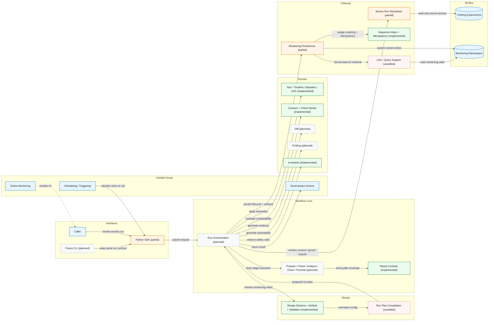

# MLflow-Monitor System Architecture

This diagram presents MLflow-Monitor as a compact system architecture, emphasizing subsystem responsibilities, explicit interactions, and the boundary between core monitoring logic and MLflow-backed persistence. It is intended as a public-facing architecture view rather than an execution trace.

**Current status:** domain semantics, invariants, result contract foundations, and gateway abstraction are real today. Full workflow execution, run-plan compilation, diff/finding engines, persisted artifact contract, query contract, and promotion semantics remain partial, planned, or unsettled in the current repository.
