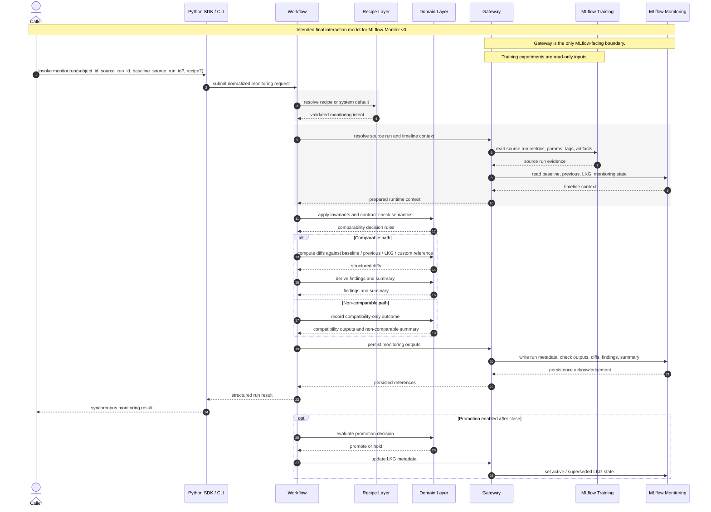

# MLflow-Monitor Runtime Sequence

This diagram presents the intended end-to-end interaction model for one MLflow-Monitor run. It focuses on the formal runtime collaboration between interfaces, workflow logic, semantic layers, the gateway, and MLflow-backed storage.

**Current status:** foundational domain semantics, recipe validation, workflow lifecycle primitives, result envelope, and gateway abstraction exist today. End-to-end orchestration, analysis engines, promotion flow, and query APIs are still not implemented as a complete runtime path in the current repository.
