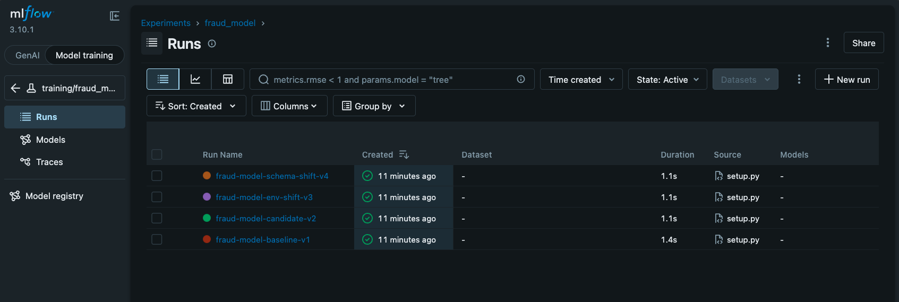
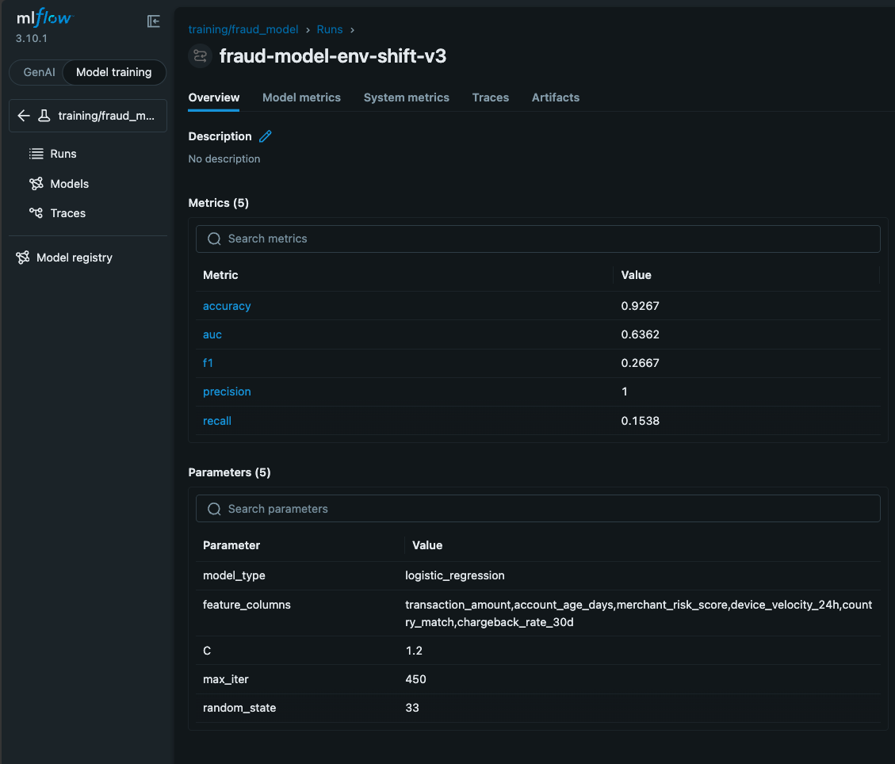
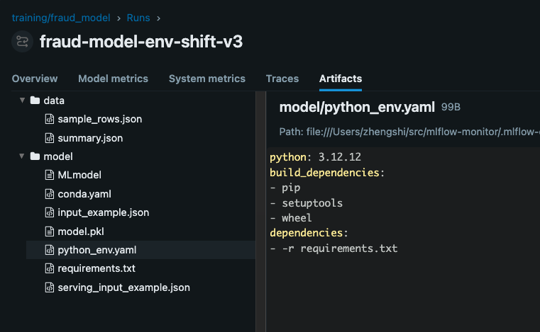
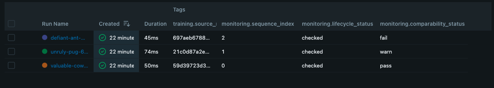
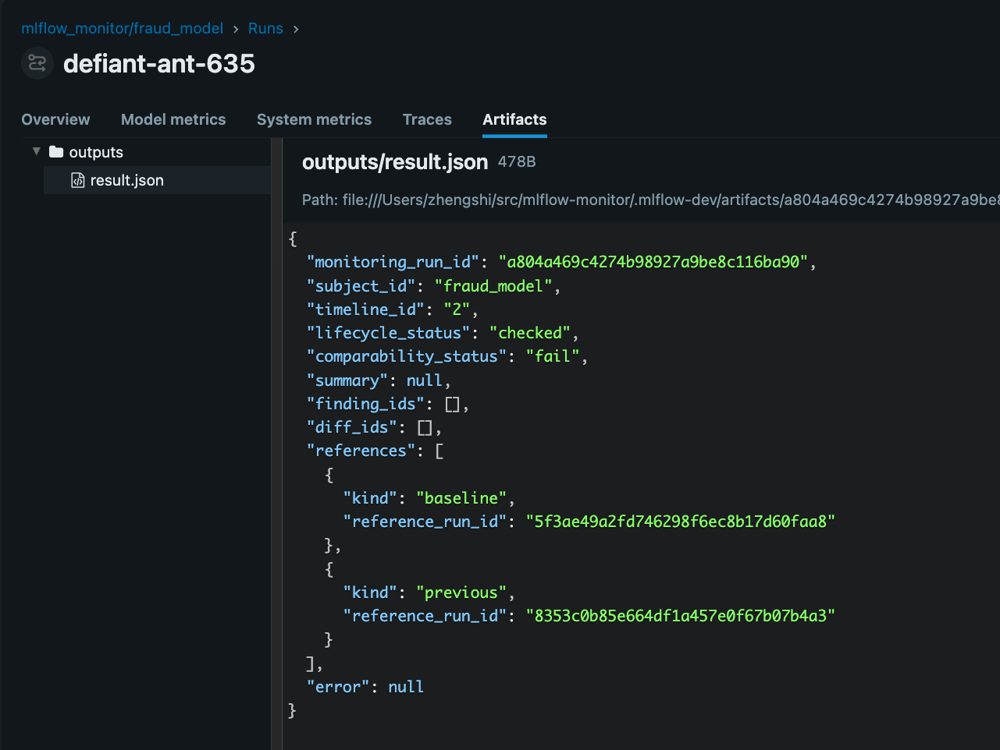
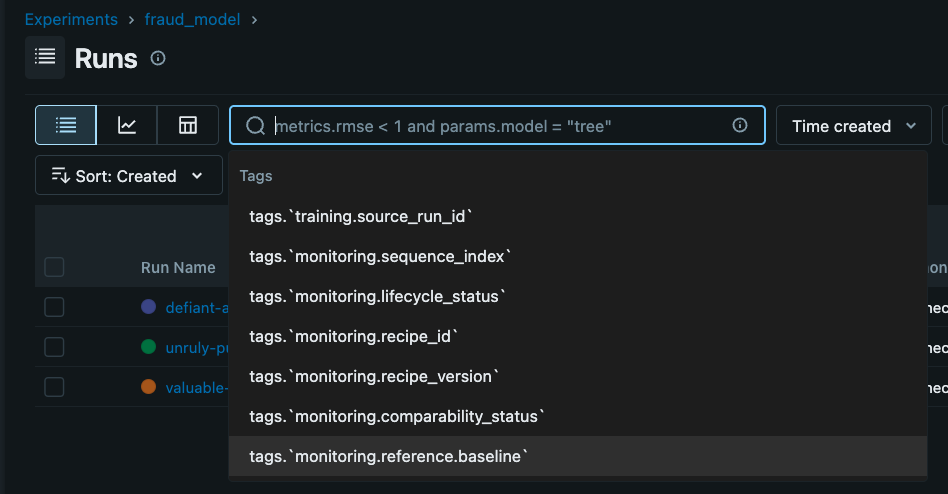
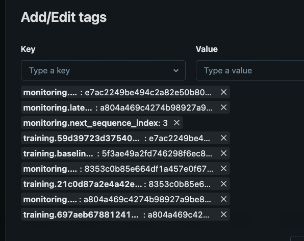

# Fraud Demo Walkthrough

This demo shows a small end-to-end monitoring flow on top of real MLflow training runs.

It seeds four fraud-model training runs from checked-in model and dataset assets, with realistic metrics, dataset-related artifacts, and the metadata used by the current monitoring workflow.

## What You Will See

- one training experiment: `training/fraud_model`
- four training runs:
  - baseline
  - comparable candidate
  - environment-mismatch candidate
  - non-comparable candidate
- one monitoring experiment after you run the monitoring step:
  - `mlflow_monitor/fraud_model`
- monitoring outcomes that cover:
  - `pass`
  - `warn`
  - `fail`

## Setup

Create a local MLflow store at the repo root:

```bash
mkdir -p .mlflow-dev
```

Expected local store layout:

- `.mlflow-dev/mlflow.db`
- `.mlflow-dev/artifacts/`

Install the core repo environment and start the MLflow UI:

```bash
uv sync
uv run mlflow ui --port 5000 --backend-store-uri sqlite:///$PWD/.mlflow-dev/mlflow.db
```

If you want to run `pytest` or `ruff`, install the development extra separately with
`uv sync --extra dev`.

Open [http://127.0.0.1:5000](http://127.0.0.1:5000).
If that does not work in your browser, try [http://localhost:5000](http://localhost:5000).

## Seed The Training Runs

Run:

```bash
MLFLOW_TRACKING_URI=sqlite:///./.mlflow-dev/mlflow.db uv run demo/setup.py
```

The script prints the four training run IDs and tells you to run the monitoring step next.

After the script finishes, refresh the browser if the UI was already open.

Quick verification:

- the UI should show `training/fraud_model`
- `.mlflow-dev/artifacts/` should exist locally
- Note: if root `mlflow.db` or `mlruns/` shows up, that means the demo was run against the wrong store

<p align="center">
  

</p>

## Seeded Training Runs

The demo seeds these four roles:

- `fraud-model-v1`
  The trusted baseline run.
- `fraud-model-v2`
  A comparable candidate that should produce `pass`.
- `fraud-model-v3`
  A candidate with environment metadata changes that should produce `warn`.
- `fraud-model-v4`
  A candidate with schema metadata changes that should produce `fail`.

Each training run includes:

- a checked-in MLflow model artifact
- metrics such as `accuracy`, `auc`, `f1`, `precision`, and `recall`
- model parameters
- schema and environment tags used by the monitoring contract
- dataset-related artifacts under `data/`

For the training side, the easiest things to inspect in the UI are:

- run names
- metrics
- params
- `model/`
- `data/train.csv`
- `data/eval.csv`
- `data/summary.json`
- `data/sample_rows.json`

<p align="center">
  
  
</p>

## Run Monitoring

Run:

```bash
MLFLOW_TRACKING_URI=sqlite:///./.mlflow-dev/mlflow.db uv run demo/run_monitoring.py
```

This script resolves the seeded runs automatically and executes the monitoring flow in order:

1. comparable candidate with explicit baseline -> `pass`
2. environment-mismatch candidate -> `warn`
3. non-comparable candidate -> `fail`

Expected result for all three monitoring runs:

- `lifecycle_status = checked`

Expected comparability results:

- comparable candidate -> `pass`
- environment-mismatch candidate -> `warn`
- non-comparable candidate -> `fail`

After the script finishes, refresh the browser if the UI was already open.

Quick verification:

- the UI should show `mlflow_monitor/fraud_model`
- monitoring runs should appear in that experiment
- repo-root `mlflow.db` or `mlruns/` means the demo was run against the wrong store

<p align="center">
  
</p>

## What To Inspect In MLflow

### Training Experiment

Open `training/fraud_model` and verify:

- the four training runs exist
- each run has metrics and params
- each run has a `model/` artifact tree
- each run has `data/train.csv` and `data/eval.csv`
- each run has `data/summary.json` and `data/sample_rows.json`

### Monitoring Experiment

After running `uv run demo/run_monitoring.py`, open `mlflow_monitor/fraud_model` and verify:

- monitoring runs are present
- the baseline is reused after the first run
- each monitoring run has `monitoring.lifecycle_status`
- each monitoring run has `monitoring.comparability_status`
- `outputs/result.json` exists on the monitoring run

Open the monitoring runs first.

The most readable proof points in the UI are:

- run names
- `monitoring.lifecycle_status`
- `monitoring.comparability_status`
- `training.source_run_id`
- `monitoring.reference.baseline`
- `outputs/result.json`

`outputs/result.json` is the clearest single artifact to inspect because it shows the final monitoring result in one place.

<p align="center">
  
  
</p>

### Timeline Bookkeeping

Experiment tags are also important. They hold the timeline state, including:

- baseline run id
- latest monitoring run id
- next sequence index
- indexed monitoring run ids

These tags are useful to confirm that monitoring state is persisted separately from training runs, but they are more bookkeeping-oriented than demo-friendly because the values are long run IDs.

<p align="center">
  
</p>

## What MLflow Gives You vs What MLflow-Monitor Adds

Raw MLflow gives you:

- training runs
- model artifacts
- metrics
- params
- tags

MLflow-Monitor adds:

- a baseline-aware workflow
- comparability outcomes
- a separate monitoring timeline
- durable monitoring result artifacts

That is why the demo uses two experiments: one for training history and one for monitoring history.

## Cleanup

The local `.mlflow-dev/` directory is disposable. To reset the demo:

```bash
rm -rf mlflow.db mlruns .mlflow-dev
mkdir -p .mlflow-dev
export MLFLOW_TRACKING_URI=sqlite:///./.mlflow-dev/mlflow.db
```
