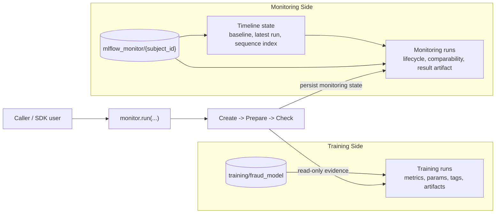

# Architecture

MLflow-Monitor keeps training history and monitoring history separate.

Training runs remain the source of truth for model artifacts and training metadata. Monitoring runs read that evidence, evaluate comparability, and persist their own state in a monitoring-owned experiment.

## Runtime Model

The current workflow is intentionally narrow:

- create or reuse a monitoring run for one source training run
- prepare baseline and comparison context
- execute the contract check
- persist a terminal monitoring result

This keeps the runtime focused on one job: deciding whether a training run is comparable to the baseline and recording that decision.

## Training Side

MLflow training experiments hold the original model-development history:

- metrics
- params
- tags
- model artifacts
- optional dataset-related artifacts

MLflow-Monitor reads from those runs but does not mutate them.

## Monitoring Side

MLflow-Monitor creates one monitoring experiment per subject:

- `training/fraud_model` contains source training runs
- `mlflow_monitor/fraud_model` contains monitoring runs for that subject

The monitoring experiment stores:

- the pinned baseline
- the latest monitoring run id
- the next sequence index
- indexed run references for timeline traversal

Each monitoring run stores:

- lifecycle status
- comparability status
- baseline and other references
- `outputs/result.json`

## Why This Split Matters

This separation makes the system easier to reason about:

- training history stays immutable
- monitoring has durable memory
- baseline selection is explicit
- comparability success is distinct from workflow execution success

A monitoring run can complete successfully and still report `fail` comparability. That is a valid and useful outcome, not a crash.
