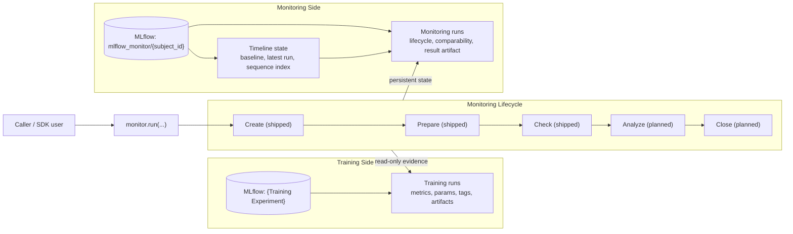

# Architecture

MLflow-Monitor keeps training history and monitoring history separate.

Training runs remain the source of truth for model artifacts and training metadata. Monitoring runs read that evidence, evaluate comparability, and persist their own state in a monitoring-owned experiment.

Stages with dashed borders are designed but not yet in the runtime.

## Runtime Model

The full monitoring lifecycle is create → prepare → check → analyze → close.

The current runtime ships the first three stages:

- Create or reuse a monitoring run for one source training run
- Prepare baseline and comparison context
- Execute the contract check
- Persist a terminal monitoring result

Analyze (diff computation and finding generation) and close (finalization and optional LKG promotion) are the next stages on the roadmap.

## Training Side

MLflow training experiments hold the original model-development history: metrics, params, tags, model artifacts, and optional dataset-related artifacts.

MLflow-Monitor reads from those runs but does not mutate them.

## Monitoring Side

MLflow-Monitor creates one monitoring experiment per subject. For example, `training/fraud_model` contains source training runs, and `mlflow_monitor/fraud_model` contains monitoring runs for that subject.

The monitoring experiment holds timeline-level state: the pinned baseline, the latest monitoring run id, the next sequence index, and indexed run references for timeline traversal. These exist at the experiment level because they are properties of the subject's history, not of any individual monitoring run.

Each monitoring run holds its own evaluation state: lifecycle status, comparability status, baseline and other references, and the final `outputs/result.json` artifact. These exist at the run level because they are specific to one evaluation event.

## Why This Split Matters

A monitoring run can complete successfully and still report `fail` comparability. That is a valid and useful outcome, not a crash. Comparability success is distinct from workflow execution success.

This separation keeps training history immutable, gives monitoring its own durable memory, makes baseline selection explicit, and preserves a clean audit trail from evidence through verdict.
