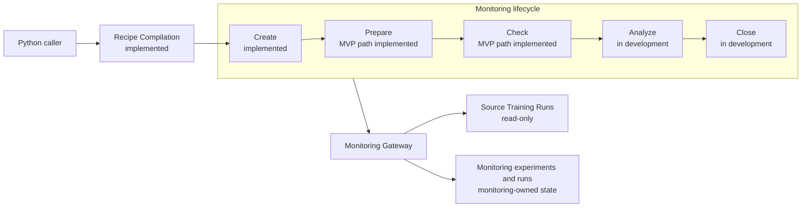
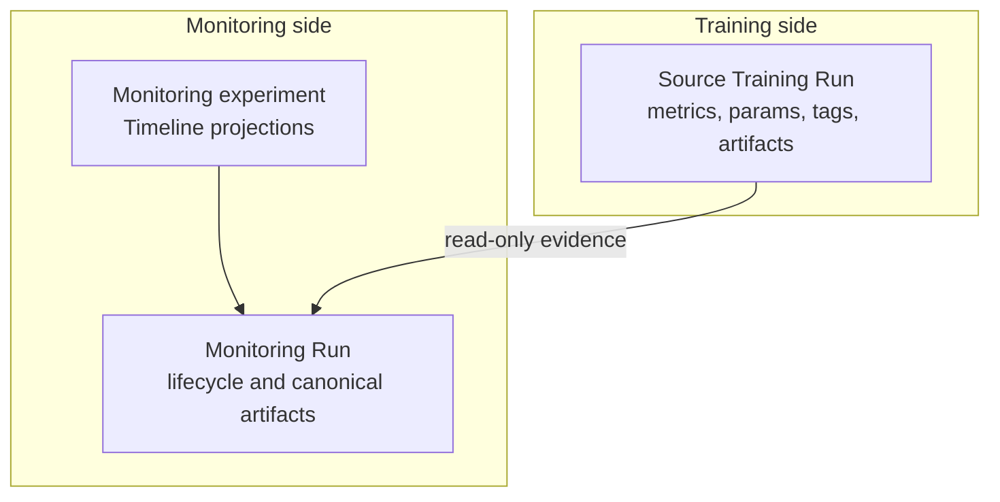

# V0 Architecture

> **Active development:** This page describes the architecture being delivered on
> `main`, currently identified as `0.2.0.dev0`. Status labels distinguish the
> implemented path from later v0 stages. For the stable MVP architecture, see
> {doc}`mvp`.

## System flow



Recipe Compilation is side-effect-free preflight work. It parses strict data,
expands defaults, resolves the exact system Contract and registered Finding
policies, validates policy parameters, and returns an immutable `CompiledRecipe`.
It performs no MLflow reads and allocates no Monitoring Run.

The current runtime still uses the compiled system default internally. Accepting a
caller-supplied `CompiledRecipe` at the public monitoring boundary remains under
development.

## Architectural boundaries

### Caller

The caller owns invocation-specific identity: the subject, current Source Training
Run, initial Baseline Source Run when required, and any custom reference. These
values do not belong in a reusable Recipe.

### Recipe compiler

The compiler owns structural validation, exact component resolution, default
expansion, canonical ordering, and policy-parameter validation. Its normalized
effective plan contains serializable data; executable policy objects remain
process-local.

### Workflow

The workflow owns stage ordering and domain decisions:

```text
Create -> Prepare -> Check -> Analyze -> Close
```

Lifecycle status and comparability status are independent. A Contract-check
`fail` is a successful monitoring conclusion and ultimately closes normally. A
lifecycle `failed` status represents an execution or persistence failure.

### Gateway

The Gateway is the persistence boundary. Workflow code depends on monitoring
semantics rather than MLflow APIs. The in-memory implementation supports
deterministic tests, while `MLflowMonitoringGateway` maps the same operations to
monitoring-owned MLflow state.

### MLflow client adapter

`MonitorMLflowClient` is the only runtime layer that directly wraps
`MlflowClient`. It normalizes narrow MLflow mechanics for the Gateway; it does not
own workflow policy.

## Data ownership



Source Training Runs are never mutated. Monitoring lifecycle, comparability,
evidence, Findings, results, and recovery state belong to the Monitoring Run or
its subject's monitoring experiment.

Whenever a materialized domain value carries `monitoring_run_id`, it also carries
the immutable `source_run_id`. The Baseline Source Run is source-only: it has no
`monitoring_run_id` and consumes no Timeline sequence index.

## Stage behavior

| Stage | Responsibility | Status on `main` |
| --- | --- | --- |
| Recipe Compilation | Parse, normalize, resolve components, and validate policy parameters | Implemented |
| Create | Allocate or reuse Monitoring Run identity | Implemented |
| Prepare | Resolve source, baseline, requirements, and references | MVP path implemented; durable hydration in development |
| Check | Apply the resolved Contract and produce comparability reasons | MVP path implemented; canonical artifact commit in development |
| Analyze | Produce Diffs, coverage, Compatibility Evidence, and Findings | In development |
| Close | Persist the final result and close successfully | In development |

The current MVP-compatible runtime finishes successful work at `checked`. The v0
target writes each stage's canonical artifacts before advancing its lifecycle
commit marker and finishes valid `pass`, `warn`, and `fail` outcomes at `closed`.

## Concurrency and recovery boundary

The MLflow Gateway detects contradictory allocation and evidence state and fails
closed rather than silently overwriting it. It does not claim to serialize
concurrent callers. Idempotent re-execution may reuse identical deterministic
state; conflicting content at the same identity or artifact path is a consistency
error.

V0 does not introduce locks, leases, a transition log, or an external database.

