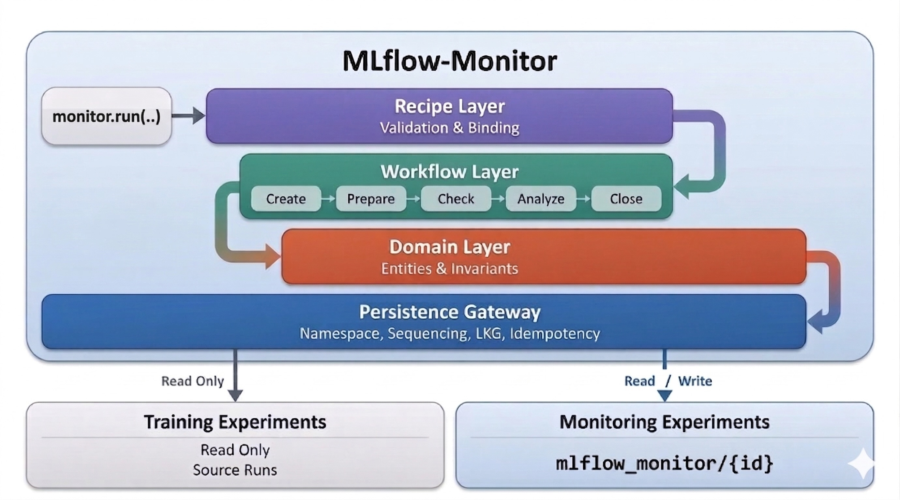

.. mlflow-monitor development documentation master file, created by
   sphinx-quickstart on Wed Mar 25 15:38:52 2026.
   You can adapt this file completely to your liking, but it should at least
   contain the root `toctree` directive.

Internal Developer Docs
=======================

Local documentation site for development of MLflow-Monitor.

Diagram
-------

Concepts
--------

.. toctree::
   :maxdepth: 1
   :titlesonly:

   worldview
   architecture

Code Structure
--------------

.. toctree::
   :maxdepth: 1

   monitoring
   cast
   recipe
   contract
   gateway
   client
   workflow
   errors