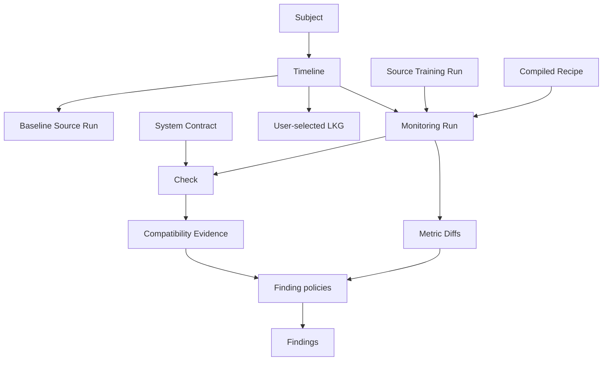

# V0 Worldview

> **Active development:** This page describes the v0 product direction on
> `main`, currently identified as `0.2.0.dev0`. It distinguishes behavior already
> implemented from behavior still under development. For the stable MVP, see the
> {doc}`mvp` page.

## Why monitoring has its own history

MLflow records how a model was trained. Monitoring answers a different question:
how should one Source Training Run be evaluated relative to stable and historical
references?

MLflow-Monitor treats that evaluation as a first-class workflow. Source Training
Runs remain read-only. Every evaluation is represented by a separate Monitoring
Run in a monitoring-owned experiment, preserving both training history and the
evidence used to reach monitoring conclusions.

## Core principles

- **Evidence precedes interpretation.** Contract-check observations and metric
  Diffs are objective inputs. Findings are policy-versioned conclusions derived
  from those inputs.
- **Comparability precedes metric analysis.** A Contract determines whether the
  current Source Training Run can be meaningfully compared with the immutable
  Baseline Source Run.
- **Baseline and trust are explicit.** The Baseline Source Run is pinned once.
  LKG is a separate user-owned selection of a closed Monitoring Run; it is not
  inferred from deployment or metric values.
- **Execution identity stays out of Recipes.** A Recipe describes reusable
  behavior. The caller supplies `subject_id`, `source_run_id`, and optional
  invocation-specific reference identity.
- **Recovery must not reinterpret history.** Exact Recipe, Contract, source,
  baseline, and reference decisions are frozen before later stages consume them.

## The v0 world model

The concepts have deliberately different responsibilities:

- A **Recipe** selects reusable monitoring behavior and registered components.
- A **Contract** defines structural comparability for Check.
- A **Diff** records one objective metric change against one reference.
- A **Finding policy** interprets immutable Diffs, Compatibility Evidence, and
  Reference Comparison Coverage.
- A **Finding** is one validated conclusion for one Monitoring Run.

Finding policies do not create Diffs, and a comparability `fail` is not a workflow
failure. A non-comparable Monitoring Run still proceeds through Analyze without
metric Diffs so that its Compatibility Evidence and Findings can be preserved.

## Development status

### Implemented on `main`

- the real-MLflow Create, Prepare, and Check path from the MVP;
- paired `monitoring_run_id` and immutable `source_run_id` domain identity;
- typed Diff, coverage, Compatibility Evidence, Finding, Timeline, and LKG models;
- deterministic evidence and Finding identity helpers;
- strict JSON-compatible Recipe parsing and side-effect-free compilation; and
- system and custom Finding-policy registration during Recipe compilation.

### In active development

- public `CompiledRecipe` integration at the monitoring boundary;
- durable Prepare and Check artifacts with deterministic hydration;
- fixed reference resolution and scalar metric Diff execution;
- Finding-policy execution, Analyze, Close, and complete recovery; and
- query and explicit LKG selection workflows.

### Outside v0 scope

- model deployment, Promotion, and rollback execution;
- notification and scheduling systems;
- automatic LKG selection;
- custom Contracts and Contract checkers;
- slices, custom metric providers, and plugin discovery; and
- distributed locking or a new persistence database.

