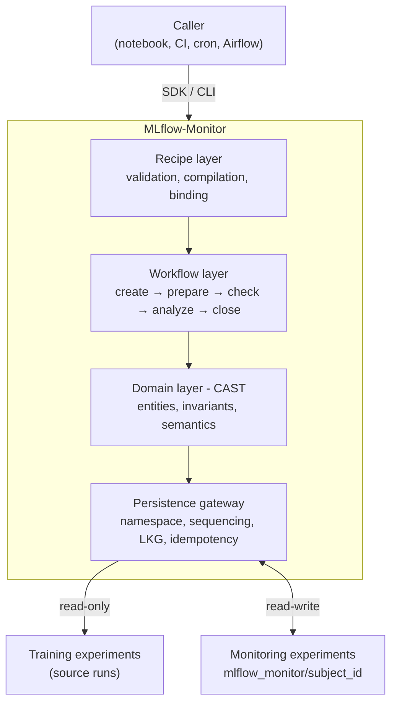

# MLflow-Monitor v0: High-Level Design

## 1. Purpose and Problem

### 1.1 What MLflow-Monitor Is

MLflow-Monitor is an offline model performance monitoring system built on top of MLflow. It reads from existing MLflow training experiments, evaluates model performance against baselines and contracts, and produces actionable findings — all without requiring teams to change their existing training workflows.

The scope is explicitly offline monitoring — evaluating logged training run outputs after the fact. Online monitoring (live inference tracking, real-time data drift detection) requires fundamentally different tooling and is out of scope for MLflow-Monitor.

### 1.2 The Problem

ML teams that use MLflow for experiment tracking face a recurring operational gap: training runs are logged, but there is no structured way to monitor how model performance evolves over time, detect regressions against trusted baselines, or enforce comparability before interpreting metric changes.

In practice, teams fill this gap with ad-hoc scripts that:

1. Lack stable baselines — comparisons drift as teams forget what the reference point was.
2. Skip comparability checks — dependencies and environment mismatches make models incomparable, while schema changes, feature set changes, and data scope changes make metric comparisons misleading, but nothing catches either case.
3. Mix up evidence and interpretation — raw metric deltas are treated as actionable without structured severity assessment or evidence linkage.
4. Are not reproducible — monitoring logic is embedded in one-off notebooks and CI jobs with no versioning or audit trail.

MLflow-Monitor addresses this by making baseline-aware comparison, comparability gating, and structured finding generation first-class system behaviors rather than ad-hoc scripting concerns.

The whole point of structured monitoring is to answer a concrete question: is this model good enough to promote? MLflow-Monitor aligns directly with MLflow's own model promotion concept — monitoring exists in service of informed promotion decisions.

### 1.3 Core Design Constraints

Three constraints shape every architectural decision in v0:

1. **No custom database.** The system uses MLflow as its persistence layer. No additional infrastructure to deploy or maintain.
2. **No pollution of training experiments.** Monitoring outputs are written to a dedicated namespace, completely separated from team training data.
3. **No modification of original training runs.** Source training runs are read-only inputs. MLflow-Monitor never writes to, appends to, or modifies any training run.

---

## 2. Design Philosophy

### 2.1 Comparability First

No metric comparison or interpretation happens before the system has verified that the runs being compared are actually comparable. Schema mismatches, feature set changes, data scope differences, and environment mismatches are caught explicitly — not after someone has already drawn conclusions from invalid deltas.

Environment mismatches (different Python version, different library versions) produce a `warn` by default — the comparison proceeds but the caveat is attached. Schema, feature, and data scope mismatches produce a `fail` — the comparison is blocked entirely.

### 2.2 Evidence Before Interpretation

The system maintains a strict separation between objective change records (diffs) and prioritized interpretations (findings). Diffs answer "what changed." Findings answer "so what should we do." This separation preserves auditability and prevents teams from acting on unsupported conclusions.

### 2.3 Trajectory Over Snapshot

Monitoring is a time-series problem. A single run in isolation tells you very little. MLflow-Monitor treats the ordered sequence of runs (the timeline) as the primary analytical context, with baseline, LKG, and anchor window concepts providing different perspectives on the same trajectory.

### 2.4 Zero Config to Value, More Config for Precision

The system ships with a default recipe and default behaviors that produce useful output with no user configuration. Users can add recipes, contracts, and policies to increase precision. Bad configuration fails loudly with specific, actionable error messages that tell the user what went wrong and how to fix it. The system never silently degrades.

### 2.5 Gateway-Mediated Persistence

All reads from training experiments and all writes to monitoring experiments pass through a single gateway abstraction. No component in the system interacts with MLflow primitives directly. This enforces namespace safety, ordering guarantees, and provides a future migration path away from MLflow if needed. Domain and workflow code is platform-agnostic — all MLflow-specific logic lives exclusively in the gateway, which means the core monitoring logic could be reused with a different persistence backend in the future.

---

## 3. System Boundary

### 3.1 Entry Point

MLflow-Monitor is invoked via a Python SDK or CLI. Both are synchronous, caller-initiated interfaces.

**SDK:**

```python
from mlflow_monitor import monitor

# First run for a subject: baseline_source_run_id is required.
result = monitor.run(
    subject_id="churn_model",
    source_run_id="train_run_2026_03_10",
    baseline_source_run_id="train_run_2026_03_01",
)
```

**CLI:**

```bash
# First run for a subject: baseline-source-run is required.
mlflow-monitor run \
  --subject churn_model \
  --source-run-id train_run_2026_03_10 \
  --baseline-source-run-id train_run_2026_03_01
```

The CLI is a thin wrapper over the SDK. The system does not own scheduling or triggering — the caller decides when and how to invoke monitoring runs (cron, CI pipeline, Airflow task, notebook, etc.). After a timeline has been initialized, the caller can omit `baseline_source_run_id`; the system resolves the pinned baseline from timeline state.

### 3.2 Output Delivery

The system delivers results through two paths:

1. **Synchronous return value.** The SDK call returns a structured result object containing run status, comparability outcome, diffs, findings, and summary. The caller can inspect, log, or act on results immediately.
2. **Persisted queryable history.** All run outputs are written to MLflow as structured artifacts and metadata. Users can query timeline history and anchor-window views after the fact.

Because the SDK returns a result synchronously, downstream actions (Slack alerts, deployment triggers, logging) are trivially handled by the caller in a few lines of code without requiring built-in notification infrastructure.

### 3.3 What Is Inside the System Boundary

1. Source training run resolution and input validation.
2. Comparability checking against contracts.
3. Diff computation against baseline, previous run, LKG, and optional custom reference.
4. Finding generation with severity and evidence linkage.
5. Persistence of all outputs to the monitoring namespace.
6. Timeline and anchor-window query support.
7. Recipe validation, compilation, and binding — designed to be as simple as possible so users are not discouraged by complex configuration.

### 3.4 What Is Outside the System Boundary

1. Scheduling and triggering (caller's responsibility).
2. Downstream actions on results — notifications, alerts, deployment decisions (caller's responsibility).
3. Training experiment management — MLflow-Monitor is a consumer, not an owner.
4. Live inference monitoring or real-time drift detection.

---

## 4. Domain Model (CAST)

CAST (Core Actors and State Transitions) defines the entities and relationships that give MLflow-Monitor its semantic foundation.

### 4.1 Entities

**Run** — A single monitoring evaluation. In MLflow terms, this is one MLflow run inside the `{namespace_prefix}/{subject_id}` monitoring experiment. Each monitoring run evaluates the outputs of one source training run. This is not a training run — it is the system's assessment of a training run.

**Baseline** — The reference training run that the team designates as the starting point for a timeline. In practice, this is typically the training run that produced the model currently in production, or the first model version the team considers "known good." The baseline captures model identity, data scope, configuration, observed metrics, and environment context. Immutable once pinned — this ensures all historical comparisons remain valid. See §15 (Future Development) for baseline reset discussion.

**Timeline** — An ordered sequence of monitoring runs for one subject. Represents model evolution over time. One subject maps to one timeline.

**LKG (Last Known Good)** — The most recent monitoring run that passed all quality gates defined by the promotion policy. At most one active LKG per timeline at any time. LKG is purely a monitoring concept — it means "last known good from monitoring's perspective." LKG is distinct from production deployment status: a model may be deployed to production but not yet promoted to LKG (e.g. still ramping via A/B testing, or actively being monitored before trust is established). Conversely, a run may be LKG but not in production (validated by monitoring, but not yet deployed). Multiple models may be serving in production simultaneously while only one is LKG on its timeline.

**Contract** — Rules defining comparability and diff semantics. Covers schema, feature set, metric definitions, data scope, and execution environment. Produces a comparability verdict: pass, warn, or fail. For v0, environment checks are scoped to what directly affects model output reproducibility: Python major/minor version and key ML framework versions (sklearn, torch, xgboost, etc.). Deployment-specific environment details (OS, hardware, serving infrastructure, CUDA version) are out of scope for v0 environment checks. Users can extend via custom contracts later.

**Diff** — An objective change record between a run and a reference point. Factual evidence of what changed, with no interpretation attached.

**Finding** — A prioritized, interpreted issue derived from one or more diffs. Maps evidence to severity, category, and action guidance.

### 4.2 Relationships

1. A Timeline has many Runs, ordered by sequence index.
2. A Timeline has exactly one pinned Baseline.
3. A Timeline has at most one active LKG pointer.
4. Each Run is evaluated against one active Contract.
5. Each comparable Run produces Diffs against available references.
6. Findings are derived from Diffs, with explicit evidence linkage.

### 4.3 Subject Model

A subject represents a monitored concern at a higher level than a single model — it is a use case, a product feature, or a model family. A subject maps 1:1 to an MLflow training experiment. In MLflow-Monitor, the terms "subject" and "experiment" refer to the same thing: the MLflow experiment that contains the training runs being monitored.

A subject's timeline contains multiple monitoring runs, each evaluating one training run from that experiment. Over time, the underlying model architecture, hyperparameters, or even the modeling approach might change within the same subject. As long as the team considers it "the same thing being monitored," it remains one subject with one timeline. If the change is so fundamental that comparisons become meaningless, the contract check catches it and the team decides whether to update the contract or start a new subject.

The subject ID determines:

1. Which MLflow training experiment is the read source.
2. The monitoring experiment namespace: `{namespace_prefix}/{subject_id}`.
3. The timeline identity — one subject, one timeline, one monitoring experiment.

Subject IDs should be stable, team-agreed identifiers (e.g. `churn_model`, `fraud_scorer`). The system derives all experiment naming from the subject ID. Users never manually name monitoring experiments.

### 4.4 Diff Reference Model (v0)

Every comparable run produces diffs against these references:

1. **Baseline** — always, if comparable. Long-term drift and regression detection.
2. **Previous run** — if a previous run exists. Iteration-to-iteration movement.
3. **LKG** — if an LKG exists. Gap between current state and last trusted state.
4. **Custom reference** — optional, user-specified via recipe. Any run on the same timeline. Enables retrospective comparisons (e.g. "compare against the model from 3 months ago") without counterfactual infrastructure.

Defaults (baseline + previous + LKG) always execute. Custom reference is additive. Cross-timeline custom references are not supported in v0.

---

## 5. Workflow Model

### 5.1 Lifecycle State Machine

```
created → prepared → checked → analyzed → closed
    ↓         ↓          ↓          ↓
  failed    failed     failed     failed

closed → promoted (optional, policy-driven)
```

Each stage has a defined set of inputs, actions, outputs, and transition rules. The `failed` state is terminal and reachable from any stage. Lifecycle state and comparability status are independent dimensions — a run can be `closed` with comparability `fail`. Promotion is a post-close action and does not mean the run is no longer `closed`.

### 5.2 Stage Behaviors

**Create** — Allocate run identity, record request context (subject ID, recipe reference, trigger metadata). Transition to `created`.

**Prepare** — Resolve timeline, pinned baseline, previous run, active LKG, custom reference (if specified), active contract, and source training run. If no timeline exists for the subject, the caller must provide an explicit `baseline_source_run_id`; the gateway uses that training run to initialize the sentinel and pin the baseline. That baseline must resolve for the same subject and satisfy the compiled recipe's `source_experiment` filter before bootstrap succeeds. Once initialized, the baseline is always resolved from timeline state and is immutable. A later caller-supplied `baseline_source_run_id` is accepted only when it resolves to the existing pinned baseline under the same subject and `source_experiment` constraints; otherwise it is rejected instead of being silently ignored. Validate required metrics and artifacts exist on the source run. On success, transition to `prepared`. On missing required inputs, transition to `failed` with explicit validation error.

**Check** — Execute contract checks (schema, features, metric definitions, data scope, execution environment). Aggregate into comparability status: pass, warn, or fail. Persist machine-readable reasons. Transition to `checked`.

**Analyze** — Two paths diverge based on comparability:

- *Comparable path (pass or allowed warn):* Compute diffs against all available references. Generate findings with severity and evidence linkage. Build run summary.
- *Non-comparable path (fail):* Skip metric diff computation. Emit explicit non-comparable records. Generate compatibility findings if policy defines them. Build summary with non-comparable emphasis.

Transition to `analyzed`.

**Close** — Write all run metadata, contract check outputs, diffs, findings, lineage references, and summary to the monitoring namespace via the gateway. On success, transition to `closed`. On failure, transition to `failed`.

**Promote (optional)** — After a run is closed, evaluate LKG promotion policy if enabled. Promote or hold based on configurable gates. Promotion does not re-run analysis. This is a core feature that aligns directly with MLflow's model promotion concept — monitoring exists to determine whether a run is good enough to be promoted.

*Design note on usability:* The system should minimize the configuration burden on users. The default recipe reads whatever MLflow already has — users do not need to prepare anything special in their training pipeline. Required metrics and artifacts are opt-in additions, not prerequisites. When validation fails, error messages should be specific and actionable (e.g. "source run abc123 is missing metric f1 — either log this metric in your training pipeline or remove it from the recipe's required_metrics list").

### 5.3 Comparability Decision Matrix

| Condition | Status | Action |
|---|---|---|
| All contract checks pass | `pass` | Compute diffs and findings normally |
| Non-blocking deviations (e.g. environment mismatch) | `warn` | Compute diffs and findings, attach warnings |
| Blocking incompatibility (schema, feature, data scope) | `fail` | Mark non-comparable, skip metric deltas, emit compatibility outputs |

### 5.4 Failure Handling

- **Preparation failures** (unresolvable timeline, missing explicit baseline on first run, missing required inputs): transition to `failed`, record reason, emit partial summary if possible.
- **Check execution errors** (runtime exceptions, invalid checker config — distinct from logical `fail`): transition to `failed`, no analysis outputs.
- **Analysis failures** (diff or finding engine exceptions): transition to `failed`, persist partial artifacts with incompleteness marker.
- **Persistence failures** (storage write errors): transition to `failed`, persist local emergency error log if possible.

---

## 6. Recipe Layer

### 6.1 Role

Recipe is the customization surface. It captures use-case intent without altering core workflow semantics. Recipe configures *what* to run. Workflow decides *how* it runs. Domain defines *what outputs mean*. Platform defines *where outputs are persisted*.

The recipe system is designed to be as simple as possible. Users should not be discouraged by complex configuration — the system works out of the box with the default recipe, and custom recipes add precision incrementally.

### 6.2 Responsibilities (v0)

1. **Input binding** — source experiment, source-run selector, optional required metrics and artifacts, optional evaluation window/slice selectors, optional custom reference run.

Current implemented selector behavior supports explicit raw source run IDs for user-authored recipes plus the reserved runtime token used by the built-in system default recipe. Broader selector modes such as `latest` are not yet implemented in v0 code.
2. **Contract binding** — contract profile reference and strictness policy.
3. **Metric and slice binding** — metric set selection and slice dimensions.
4. **Finding policy binding** — severity mapping, category mapping, recommendation rules.
5. **Output binding** — summary/report options and sink behavior.

### 6.3 Default Recipe

MLflow-Monitor ships with a system default recipe:

- Requires no user configuration.
- Reads whatever metrics, params, and tags MLflow already has on the source run.
- No required metrics, no required artifacts, no contract gates.
- Applies default finding policy and standard summary output.

Zero-config here refers to recipe configuration, not timeline bootstrap. On the first monitoring run for a subject, the caller must still provide an explicit `baseline_source_run_id` so the system can initialize the timeline sentinel without hidden inference.

Resolution rule: if the user specifies a recipe, use it. Otherwise, use the system default. Every run always references exactly one recipe version — the invariant holds unconditionally.

### 6.4 Recipe Lifecycle

1. **Author** — user defines recipe in declarative form with stable ID and version.
2. **Validate** — structural validation (required sections), referential validation (contract/policy refs resolvable), constraint validation (v0 invariants not violated). Validation errors are specific and actionable — they tell the user exactly what is wrong and how to fix it.
3. **Compile** — normalize into executable run plan, resolve defaults, freeze effective plan snapshot.
4. **Bind** — run references exact recipe ID + version. Compiled plan attached to run context.
5. **Execute** — workflow consumes compiled plan deterministically. Recipe cannot mutate stage order or skip required checks.
6. **Audit** — run output is always traceable to recipe version. Any run can be traced back to the exact recipe configuration that produced it.

### 6.5 Recipe Invariants

1. Every run must reference exactly one resolved recipe version.
2. Recipe cannot bypass the contract check stage.
3. Recipe cannot redefine CAST entity semantics.
4. Recipe cannot alter required workflow stage ordering.
5. Recipe outputs must map to canonical diff/finding contracts.
6. Recipe cannot introduce timeline branching in v0.

---

## 7. Persistence Strategy

### 7.1 MLflow's Two Roles

MLflow plays two strictly separated roles:

**Read source (training experiments):** MLflow-Monitor reads metrics, params, tags, and artifacts from existing training runs. Training runs are read-only — the system never writes to, modifies, or appends to any training run. (See `mlflow_glossary_v0.md` for precise definitions of MLflow terms like experiment, run, tag, param, metric, and artifact.)

**Write sink (monitoring experiments):** All monitoring outputs are written to system-owned experiments under a dedicated namespace. Users never manually name or create monitoring experiments.

### 7.2 Namespace and Naming

```
{namespace_prefix}/{subject_id}

Default prefix: mlflow_monitor

Examples:
  mlflow_monitor/churn_model
  mlflow_monitor/fraud_scorer
  mlflow_monitor/demand_forecast
```

The namespace prefix is configurable via system-level configuration. This allows multiple teams sharing the same MLflow instance to use different prefixes, preventing namespace collisions:

```
# Team A
fraud_team_monitor/churn_model

# Team B
growth_team_monitor/churn_model
```

The default prefix `mlflow_monitor` works out of the box for single-team setups. The prefix is set once in configuration and applied globally — individual users do not need to specify it per run.

Naming principles:

1. System owns all monitoring experiment names. Users never type monitoring experiment names.
2. One subject maps to exactly one monitoring experiment.
3. The namespace prefix is reserved and enforced by the gateway.
4. Subject IDs are the only naming decision users make.

System-owned naming is a direct response to a known failure mode in production MLflow usage. In practice, team-managed experiment naming drifts: conventions diverge across teams, experiments proliferate with inconsistent suffixes, and discovering a model's monitoring history requires tribal knowledge. Deterministic naming eliminates this — given a subject ID, anyone can find its monitoring history without documentation.

### 7.3 Gateway Abstraction

The gateway is the single module through which all MLflow reads and writes pass. No other component in the system interacts with MLflow primitives directly.

Gateway responsibilities:

1. Enforce `{namespace_prefix}/{subject_id}` namespace for all writes.
2. Enforce read-only access to training experiments.
3. Create sentinel run for timeline initialization using the caller-supplied baseline on first run (baseline pointer storage).
4. Assign sequence index with serialized finalization per subject.
5. Check idempotency key `(subject_id, source_run_id, recipe_id, recipe_version)` before run creation. In plain terms: if you accidentally trigger the same monitoring run twice (common in CI pipelines and cron jobs), the system does not create duplicate records — it recognizes the duplicate intent and returns the existing run.
6. Resolve LKG via single `lkg_status=active` tag query per subject.
7. Enforce read visibility rule: only `closed` runs appear in timeline/window queries; `failed` runs visible with status.

### 7.4 Key Mechanisms

**Sentinel run:** A dedicated MLflow run per subject with tag `role=timeline_config`. Created once at timeline initialization. On the first monitoring run for a subject, the caller must supply `baseline_source_run_id`; the gateway stores that reference and the corresponding baseline metadata on the sentinel. Once pinned, the baseline reference is immutable — all historical comparisons remain valid, and the system never needs to reason about "which baseline was active when."

**Sequence index:** A monotonic integer tag on each monitoring run. Assigned by the gateway under serialized finalization per subject. `sequence_index = max(existing) + 1`. MLflow run IDs and timestamps are never used for timeline ordering.

**LKG tags:** `lkg_status=active` on the currently promoted run, `lkg_status=superseded` on previously promoted runs. At most one `active` per subject at any time. Promotion atomically updates both tags.

**Idempotency:** Before creating a monitoring run, the gateway checks `(subject_id, source_run_id, recipe_id, recipe_version)`. Retry of the same monitoring intent does not create duplicate records.

### 7.5 Stage-Aligned Writes

Writes to `{namespace_prefix}/{subject_id}` reflect workflow stages:

1. On prepare: source run ID, source experiment, sequence index, baseline reference, recipe version. On first run, this stage also initializes the sentinel from the explicit caller-supplied baseline.
2. On check: comparability status tag + check artifacts.
3. On analyze: diff/finding artifacts + summary artifact.
4. On close: terminal lifecycle status tag + completion metadata.
5. On promotion: LKG status tag update (active/superseded).

### 7.6 Metadata vs. Artifact Partitioning

**Tags** (for filtering and state): lifecycle status, comparability status, sequence index, subject identity, source run ID, source experiment, baseline reference, LKG status, recipe ID/version, contract ID/version, mapping version, idempotency key fields.

**Artifacts** (for structured evidence): contract check details and reason set, diff records per reference mode, finding records, run summaries and lineage snapshots, error details, baseline metadata snapshot on sentinel run.

### 7.7 Backfill Semantics

Multiple monitoring runs against the same training run are valid and expected. Each monitoring run is a separate record with its own sequence index. No overwrite, no collision. Source training runs are never modified.

---

## 8. Query Model

### 8.1 Timeline Traversal

Retrieve the ordered sequence of monitoring runs for a subject. Runs are ordered by sequence index. Both comparable and non-comparable runs are visible, with explicit status on each.

### 8.2 Anchor Window

The anchor window is a generalized timeline view. A user selects any run on the timeline as an anchor, and the system returns diffs, findings, and status for runs from that anchor onward.

Presets:

1. **Baseline-anchored** — anchor is the baseline run. Shows full trajectory from the beginning.
2. **LKG-anchored** — anchor is the current LKG. Shows performance since the last trusted state.
3. **Custom** — user specifies any run on the timeline as anchor.

Rules:

1. One anchor per query.
2. Window outputs are derived from persisted run-level outputs — no recomputation at read time.
3. Non-comparable runs are explicitly listed, not silently dropped.
4. Anchor must belong to the same timeline.

### 8.3 Read Visibility

Only `closed` runs appear in timeline and anchor-window queries by default. `Failed` runs are visible with explicit status when queried, but excluded from trajectory views and aggregations.

---

## 9. v0 Scope and Invariants

### 9.1 In Scope

1. Single timeline per subject.
2. Single active contract version per timeline.
3. One pinned baseline per timeline (immutable once set).
4. One movable LKG pointer per timeline.
5. Fixed default comparisons: baseline + previous + LKG.
6. Optional custom reference run (same timeline only).
7. SDK + CLI invocation surface.
8. Default recipe for zero-config usage.
9. Recipe validation, compilation, and binding.
10. MLflow-first persistence with gateway abstraction.
11. Anchor-window timeline analysis.
12. Configurable namespace prefix for multi-team environments.

### 9.2 Out of Scope (Deferred)

See §15 (Future Development) for detailed discussion of deferred items.

### 9.3 Invariants

1. Every Run belongs to exactly one Timeline.
2. Every Timeline has exactly one pinned Baseline.
3. Every Run is evaluated against exactly one active Contract.
4. Every Run produces comparability status: pass, warn, or fail.
5. If comparability status is `fail`, no metric diffs are produced.
6. Every comparable Run produces baseline diff output.
7. Previous-run diff exists when a previous run exists.
8. LKG diff exists when an LKG exists.
9. Every Finding references one or more supporting Diffs.
10. A Timeline has at most one active LKG pointer.
11. LKG must reference an existing Run in the same Timeline.
12. Baseline is immutable once pinned to a Timeline.
13. Contract changes are explicit and versioned.
14. Non-comparable runs are visible in timeline history, never silently dropped.
15. Every run references exactly one resolved recipe version.
16. Recipe cannot bypass the contract check stage.

### 9.4 Major Incompatibility Handling

When a contract check returns `fail`, the run is marked non-comparable. The system requires explicit user action: either update the contract to accommodate the change, or start a new timeline for the new model configuration. The system does not automatically reconcile incompatible runs.

---

## 10. Intended Outcome Views

The system is designed to support these user-facing views over the data it produces:

**View 1: Single Model Trajectory** — How one model performed over time across monitoring runs. X-axis is run sequence, Y-axis is metric values, with baseline and LKG reference lines and pass/warn/fail status markers per run.

**View 2: Multi-Model Side-by-Side** — Same time window, multiple subjects compared. Implemented by querying multiple timelines in parallel. Each timeline is one subject.

---

## 11. Architecture Layers



**Layer responsibilities:**

- **Recipe Layer** configures what to run. Cannot alter workflow semantics.
- **Workflow Layer** orchestrates execution order and decision logic. Deterministic stage transitions.
- **Domain Layer** owns entity semantics and invariants. Source of truth for what outputs mean.
- **Persistence Gateway** owns all MLflow interaction. Enforces namespace, ordering, and consistency rules. All MLflow-specific logic lives here — domain and workflow code is platform-agnostic.

**Boundary rule:** Integration and persistence cannot bypass domain invariants or workflow stage ordering. Recipe cannot alter either.

---

## 12. Open Design Questions (Deferred to Implementation)

The following questions are intentionally deferred to ticket-level engineering work and should be tracked explicitly in the backlog rather than resolved ad hoc during coding. They do not affect the high-level architecture.

1. Exact recipe schema format and file conventions.
2. Whether recipe policy references are inline or registry-based in v0.
3. Concrete contract definition shape and authoring surface.
4. Minimal default finding policy package for first release.
5. Severity taxonomy and action recommendation defaults.
6. Concrete JSON/artifact schemas for diffs, findings, and summaries.
7. SDK result object field structure.
8. Supported data modalities for first release.
9. Query and report ergonomics over MLflow-backed storage.
10. Warning-level recipe validation strictness.
11. Exact promotion policy language and defaults.

---

## 13. Risk Acknowledgments

**MLflow coupling.** The system depends heavily on MLflow's experiment/run/tag/artifact model. Mitigation: all MLflow interaction is behind the gateway. Domain and workflow code is platform-agnostic — this means the core monitoring logic could be adapted to a different persistence backend in the future, making MLflow-Monitor potentially a more generic monitoring framework.

**Convention drift.** If naming and tag conventions are applied inconsistently, retrieval breaks. Mitigation: gateway enforces all conventions centrally. No direct MLflow writes outside the gateway.

**Namespace collision.** Multiple teams sharing an MLflow instance could overwrite each other's monitoring data. Mitigation: configurable namespace prefix set at system level. Each team configures their prefix once; the gateway enforces it on every write.

**Retrieval ambiguity.** If ordering or LKG resolution is implicit, different query paths may disagree. Mitigation: explicit sequence index for ordering (timestamps never used), single authoritative LKG resolution via `lkg_status=active` tag.

**Artifact inflation.** Diff and finding payloads can grow with timeline length. Mitigation: structured compact formats. Aggregation and sampling views deferred to post-v0.

**Training run mutation.** Accidental writes to training experiments would break team trust. Mitigation: gateway enforces write-only to the monitoring namespace. Any write outside this namespace is a gateway-level error, never silent.

---

## 14. Related Documents

| Document | Role |
|---|---|
| `case_v0.md` | Domain model — entities, relationships, invariants |
| `workflow_v0.md` | Workflow model — lifecycle, stages, decision tables, failure handling |
| `recipe_v0.md` | Recipe model — customization surface, validation, compilation |
| `mlflow_mapping_v0.md` | Persistence strategy — MLflow mapping, namespace, gateway |
| `system_sketch_v0.md` | System overview — architecture layers, design rationale |
| `implementation_backlog_v0.md` | Backlog — workstreams, tasks, milestones, delivery sequence |
| `mlflow_glossary_v0.md` | MLflow terminology — precise definitions of experiment, run, tag, etc. |

---

## 15. Future Development

The following items are intentionally deferred from v0. They are recorded here to preserve design intent and ensure the v0 architecture does not block them.

### 15.1 Training Run Annotation (Opt-In)

Allow MLflow-Monitor to tag source training runs with monitoring status (e.g. "outdated", "incompatible"). This would make monitoring conclusions visible directly in the MLflow training experiment UI. Deferred because it breaks the read-only constraint. Future implementation would require explicit opt-in from users granting write access to their training experiments.

### 15.2 Event-Driven and Scheduled Triggering

A long-running process that watches for new training runs and automatically triggers monitoring. The SDK-first architecture supports this — a future `mlflow-monitor watch` command would simply call `monitor.run()` when conditions are met. The key decision is whether the system owns scheduling state or stays stateless.

### 15.3 Push Notifications and Output Integrations

Proactive delivery of monitoring results to Slack, email, or webhooks. Because the SDK returns results synchronously, callers can already build this in a few lines of downstream code. A future built-in notification system would add convenience but is not required for core value delivery.

### 15.4 Counterfactual Multi-Model Comparison

What would a retired model have scored on more recent evaluation windows. Requires decoupling model identity from evaluation window. Not supported in v0 because MLflow input provides one evaluation snapshot per training run. Design note: model identity and evaluation window are kept as separate conceptual fields to avoid designing this out.

### 15.5 Production Deployment Pointer

A pointer indicating which model is currently deployed in production, distinct from both baseline (where the timeline started) and LKG (last monitoring-validated good run). Useful for "how does this new run compare to what's currently serving?" Deferred because it introduces coupling to deployment systems external to MLflow-Monitor. For v0, LKG serves as a reasonable proxy for current trusted state.

### 15.6 Deploy-Readiness Verdict

A separate pass/warn/fail axis answering "should we ship this?" alongside the existing comparability axis. Deferred to let users define their own promotion policies through the existing LKG promotion hook.

### 15.7 Baseline Reset with Epoch Marker

Allow re-pinning a new baseline on an existing timeline, creating a new epoch. The timeline continues but the reference point shifts, with the epoch boundary explicit. Deferred because it adds complexity to anchor-window queries and historical comparison logic. v0 baseline is immutable.

### 15.8 Recipe Ecosystem

Recipe inheritance and composition graphs, GUI recipe builder, template marketplace. Deferred to v1 once the core recipe model is validated in practice.

### 15.9 Multi-Backend Persistence

Abstracting the gateway to support persistence backends beyond MLflow (e.g. a dedicated database, cloud storage). The gateway abstraction already exists — future backends would implement the same interface.

### 15.10 Advanced Query and Performance

Rich query acceleration, caching, and aggregation/sampling views for large timelines. Deferred until usage patterns are clear.
