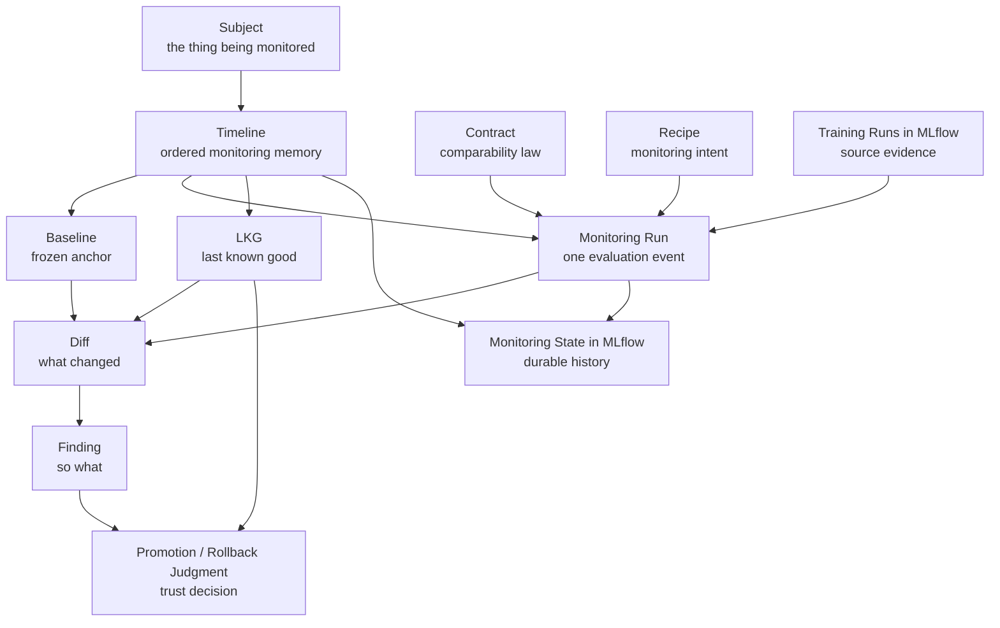

# Worldview

MLflow-Monitor is built on a simple claim:

tracking model training is not the same thing as monitoring model evolution.

MLflow is already good at remembering what happened during training. It records runs, parameters, metrics, artifacts, and experiment history. That is essential infrastructure. But it does not, by itself, answer the questions that matter once a team starts relying on a model over time:

- What is the reference point we actually trust?
- Are these runs even comparable before we start comparing metrics?
- What changed relative to the baseline, the previous state, or the last state we still trust?
- What should we do when the answer is not just “better” or “worse,” but “not comparable”?

Those are not experiment-tracking questions. They are monitoring questions.

MLflow-Monitor exists to give those questions a proper home.

## A Better Mental Model For Monitoring

Most ad hoc ML monitoring starts too late in the reasoning chain. Teams jump straight to deltas, charts, or side-by-side metrics, then try to infer meaning after the fact. That is backwards.

A serious monitoring system needs a stronger order of operations:

1. establish a durable reference point
2. determine whether comparison is valid
3. produce evidence about what changed
4. interpret that evidence into action or restraint
5. preserve the result as part of the model’s history

That ordering is the core design intuition behind MLflow-Monitor.

It is why the system is baseline-aware.
It is why comparability comes before metric interpretation.
It is why evidence and interpretation are separate layers.
It is why monitoring state needs its own memory instead of being collapsed back into the original training runs.

## The World Model

The system is easiest to understand as a set of first-class citizens that work together.

This is not just a data-flow diagram. It is the system’s conceptual universe.

- A **subject** is the stable thing a team believes it is monitoring.
- A **timeline** is the ordered memory of that subject over time.
- A **baseline** gives the timeline an anchor.
- A **run** is one monitoring evaluation event.
- A **contract** governs what counts as comparable.
- A **recipe** expresses how monitoring should be configured or bound.
- A **diff** records what changed.
- A **finding** interprets why that change matters.
- **LKG** captures the most recent state that monitoring still trusts.

Some of these ideas are already active in the current runtime. Others are more fully part of the broader design direction. They still belong to one coherent system.

> Illustration placeholder: a polished world-model image can sit alongside this Mermaid diagram later. The Mermaid view should remain the precise canonical relationship map inside the repo.

## Why These Concepts Need To Be First-Class

The most important design move in MLflow-Monitor is refusing to treat monitoring as “just another report” hanging off training runs.

The system gives names and durable structure to the ideas that teams already use informally:

- “this is our baseline”
- “this run is not really comparable”
- “this model is still the last one we trust”
- “the numbers changed, but that doesn’t mean the same thing changed”
- “the workflow succeeded, but the result is a warning”

These are not edge cases or implementation details. They are the real semantics of model monitoring.

That is why MLflow-Monitor treats baseline, timeline, contract, recipe, diff, finding, and LKG as first-class citizens instead of leaving them buried in notebooks or scattered CI logic.

## Baseline Is More Than A Pointer

In a weak monitoring system, the baseline is whatever somebody happens to compare against that day.

In a strong monitoring system, the baseline is a deliberate anchor. It is not just “that earlier run.” It is the frozen reference that makes the rest of the timeline meaningful.

Without a pinned baseline:

- comparisons drift
- teams forget what “good” meant
- regression discussions become subjective
- historical auditability falls apart

The baseline gives the timeline a center of gravity. It lets the system answer the question:

“compared to what?”

That is a foundational question in ML system design, not a reporting nicety.

## Timeline Over Snapshot

A single run in isolation tells you almost nothing about model evolution.

Monitoring is inherently temporal. What matters is not only how one run performed, but how the subject is moving:

- relative to the baseline
- relative to the immediately previous state
- relative to the last trusted state
- relative to a chosen anchor in its history

That is why the timeline matters. The timeline is not just storage. It is the unit of memory that turns a pile of runs into a trajectory.

This is also why richer concepts such as anchor-window views and multi-reference comparisons belong in the design vocabulary even if the current runtime only exposes the earlier slice of that story.

## LKG Is A Trust And Rollback Concept

LKG, or last known good, is one of the most important ideas in the system.

It is not just “the last successful run.” It is the most recent state the monitoring layer still trusts.

That makes it powerful in two directions:

- **forward-looking:** should this new state become the trusted one?
- **backward-looking:** if something goes wrong, what is the last state we can confidently return to?

This is why LKG matters to rollback intuition, promotion decisions, and operational trust. It is the bridge between monitoring and action.

A model may be in production without being the active LKG. A model may be the LKG without yet being deployed. Those are different decisions, and that distinction matters in real ML systems.

## Contract Is The Law Of Comparability

The contract exists to answer a question that too many ML systems leave implicit:

“under what conditions is comparison valid?”

That law of comparability is what stops teams from treating invalid deltas as meaningful evidence.

The contract is where the system says:

- schema changes matter
- feature identity matters
- data scope matters
- environment context matters

And the contract does not produce a vague feeling. It produces a machine-readable outcome:

- `pass`
- `warn`
- `fail`

That is a strong systems design choice. It means the workflow can succeed while still declaring that the comparison should be treated with caution or blocked entirely.

## Recipe Is Intent, Not Just File Syntax

Recipe is easy to misunderstand as “just configuration.”

In the MLflow-Monitor worldview, recipe is more important than that. Recipe is where monitoring intent lives. It defines how the system should bind inputs, contracts, metrics, slices, references, and output preferences into one versioned execution shape.

That matters for three reasons:

1. it gives teams a way to express monitoring intent declaratively
2. it makes runs traceable to the exact monitoring configuration that produced them
3. it keeps customization separate from the core semantics of the monitoring world

Recipe should not redefine the world. It should configure how the world is applied.

That distinction is part of what keeps the system understandable.

## Diff And Finding Must Stay Separate

One of the most important design separations in the system is the distinction between **diff** and **finding**.

Diff answers:

“what changed?”

Finding answers:

“so what should we do about it?”

That separation is good ML system design because it preserves auditability.

If evidence and interpretation are fused too early:

- teams cannot inspect what the system actually observed
- subjective policy gets mistaken for raw fact
- downstream trust becomes fragile

By keeping diff and finding separate, the system can support evidence-first review and still provide actionable guidance later.

## Traceability Is A Feature, Not A Side Effect

Well-designed ML systems do not just produce conclusions. They make those conclusions traceable.

That matters for engineering quality, but it also matters for governance, review, and compliance-oriented workflows. When a team asks:

- why did we trust this model?
- what was it compared against?
- what changed?
- what policy or configuration shaped that decision?
- what was the last state we considered safe?

the system should have a durable answer.

That is why MLflow-Monitor treats traceability as part of the design, not as reporting polish added afterward.

The combination of timeline, baseline, recipe, contract, run outputs, and monitoring state creates a chain of reasoning that can be inspected later:

- which subject was being monitored
- which baseline was pinned
- which training run was evaluated
- which contract governed comparability
- which recipe shaped execution intent
- what result was produced
- what state the system trusted before and after that decision

This does not automatically solve compliance for a company. But it does move the system in the right direction: explicit references, versioned intent, durable outputs, and inspectable monitoring history are much closer to compliance-friendly ML operations than ad hoc notebooks or tribal memory.

In practice, that kind of traceability is one of the clearest signs that a monitoring system was designed by people who expect it to be used in real organizations, not just in demos.

## Monitoring State Should Not Pollute Training State

Training runs and monitoring runs are related, but they are not the same kind of truth.

Training state tells you how a model was produced.
Monitoring state tells you how that model was evaluated within an evolving timeline.

Collapsing those into one record is tempting, but it weakens the system:

- training history becomes polluted with monitoring-specific bookkeeping
- monitoring memory becomes harder to query and reason about
- read-only treatment of source training runs becomes harder to enforce

That is why MLflow-Monitor writes its own monitoring history to a separate MLflow namespace. The design is intentionally additive:

- keep MLflow as the source of training truth
- layer monitoring semantics on top

That is not just convenient. It is a principled boundary.

## Why This Aligns With Good ML System Design

Underneath all of this is a broader systems belief:

good ML systems do not treat evaluation as a one-off spreadsheet exercise. They make trust, comparability, reference points, and rollback semantics explicit.

That does not require turning everything into a bloated “ML platform.” In fact, MLflow-Monitor deliberately avoids that trap. The project is not trying to own scheduling, training, or online serving. It is trying to make one layer of the stack much more rigorous:

- offline model monitoring
- baseline-aware comparison
- durable monitoring memory
- explicit trust semantics

That is enough to matter, and narrow enough to stay useful.

## Current Runtime Today

Today’s shipped runtime covers the early synchronous monitoring path:

- create
- prepare
- check

That means the current implementation already gives you:

- explicit first-run baseline bootstrap
- baseline reuse on later runs
- comparability outcomes of `pass`, `warn`, and `fail`
- persisted monitoring runs and result artifacts in MLflow

The broader world described here is still larger than today’s runtime surface. That is intentional. The public paper should describe the design universe clearly, while still being honest that some of the later concepts are design direction rather than fully exposed behavior today.

This is an early alpha, not a toy.

## Read Next

- [README.md](../README.md) for the short project entrypoint
- [architecture.md](architecture.md) for runtime structure and persistence boundaries
- [demo/README.md](../demo/README.md) for the runnable local walkthrough
