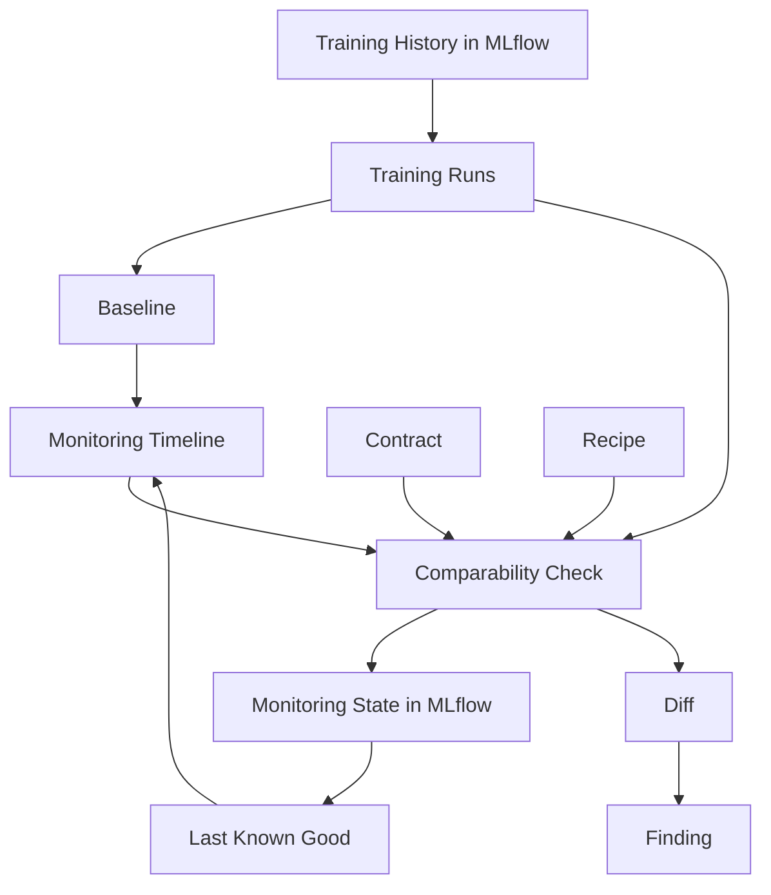

# Worldview

MLflow-Monitor starts from a simple observation:

tracking training runs is not the same thing as understanding whether those runs can be trusted, compared, and carried forward over time.

MLflow already gives teams a strong record of model development. It stores runs, metrics, parameters, tags, artifacts, and the broader experiment history around model training. That solves an important problem, but it does not fully solve the monitoring problem.

Monitoring needs memory, judgment, and structure.

It needs memory because comparison only makes sense in context.
It needs judgment because not every run should be treated as comparable.
It needs structure because one-off checks are not enough to support a durable workflow.

That is the world MLflow-Monitor is trying to create.

## The Shape Of The World

This is not just a data flow. It is a way of thinking about what model monitoring should mean.

Training runs are the evidence.
The baseline is the anchor.
The timeline is the system's memory.
The contract defines what counts as comparable.
The recipe shapes how monitoring is carried out.
Diffs capture what changed.
Findings interpret why those changes matter.
LKG represents trusted state inside the timeline.

Some of these ideas are already active in the current runtime. Others are more fully part of the intended design than the current shipped surface. They still belong in the same conceptual world.

## Why Baseline Matters

Most tracking systems make it easy to compare one run to another. That is useful, but it can also be misleading. A comparison only means something if the reference point itself is meaningful.

MLflow-Monitor treats the baseline as a first-class idea because the system needs one stable answer to the question:

"compared to what?"

Without a pinned baseline, teams drift into accidental comparisons:

- the most recent run
- whichever run someone remembers
- whichever run happened to look good in a notebook

That is not durable monitoring. It is ad hoc judgment.

The baseline gives the timeline a center of gravity.

## Why Comparability Comes Before Judgment

The core philosophical move in MLflow-Monitor is that comparability comes before evaluation.

Before asking whether a run is better, worse, safer, or promotable, the system asks whether the run is even comparable to the baseline in the first place.

That is why the design gives so much weight to ideas like:

- contract
- schema
- feature identity
- data scope
- environment context

Metric comparison without comparability is easy to produce and hard to trust.

This is why a run can complete the monitoring workflow successfully and still end with a `fail` comparability result. That is not a system failure. It is the system doing its job.

## Why Monitoring Needs Its Own Memory

The training system remembers how a model was produced.

The monitoring system needs to remember something different:

- which baseline was pinned
- what happened when a specific run was checked
- what the last trusted state was
- how the current run relates to previous monitored states

That is why monitoring state lives separately from training state.

This separation is not just an implementation detail. It expresses a design belief:

training history and monitoring history are connected, but they are not the same record.

Keeping them separate makes the system easier to reason about:

- training runs remain read-only
- monitoring can build durable state over time
- the audit trail of monitoring decisions is visible on its own terms

## Why Contract, Recipe, Diff, Finding, And LKG Belong Here

These concepts are essential because they describe different layers of monitoring meaning.

The contract answers:
"what must hold for comparison to be valid?"

The recipe answers:
"how should monitoring be configured for this run or subject?"

The diff answers:
"what changed relative to a chosen reference?"

The finding answers:
"what is the interpreted significance of that change?"

LKG answers:
"what is the most recent state we still trust?"

Even where the current runtime only exposes part of that picture, these ideas belong together. They form one coherent model of monitoring rather than a collection of disconnected features.

## The Design Intuition

MLflow-Monitor is intentionally additive.

It does not ask teams to leave MLflow behind.
It does not assume a brand new control plane.
It does not assume that raw metric tracking is enough.

Instead, it says:

- keep MLflow as the record of training
- layer monitoring semantics on top
- make baseline and comparability explicit
- let monitoring build its own durable memory

That is the worldview behind the project.

## Read Next

- [README.md](../README.md) for the short product overview
- [architecture.md](architecture.md) for the system structure
- [demo/README.md](../demo/README.md) for the runnable demo walkthrough
