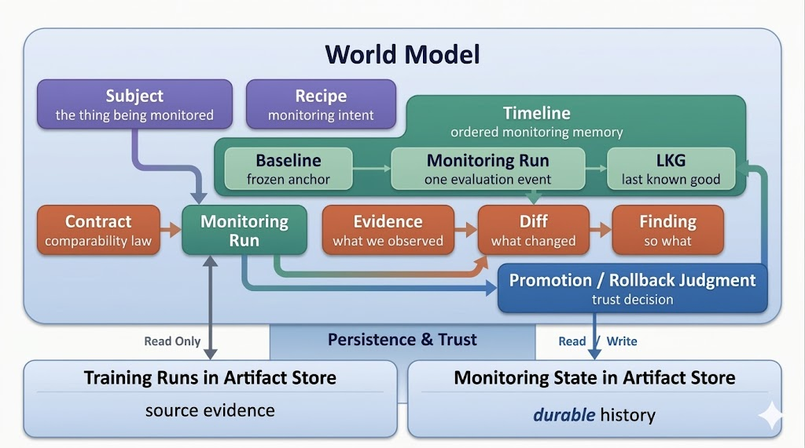
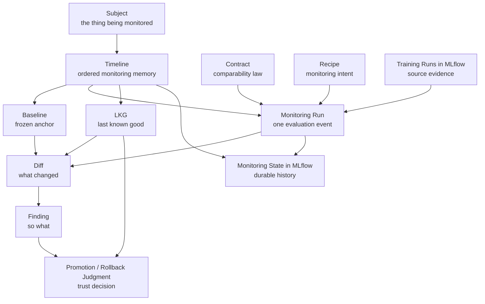

# Worldview

MLflow-Monitor starts from a simple observation:

Tracking experiments and models is not the same thing as monitoring how they evolve. Monitoring needs its own paper trail: a systematic foundation for trust decisions, auditability, and operational confidence over time.

MLflow is already good at remembering what happened during training. It records runs, parameters, metrics, artifacts, and experiment history. That is essential infrastructure. But once a team starts relying on a model over time, a different set of questions emerges, and those questions need their own structure.

That is what "monitoring as a first-class workflow" means. Monitoring is not a report hanging off a training run. It is its own discipline, with its own lifecycle, its own state, its own memory, and its own namespace. It deserves the same kind of deliberate engineering that we give to training infrastructure.

The principles that follow from this:

- Evidence comes before interpretation. We gather what the system observed before we decide what it means.
- Baselines are explicit anchors, not implicit assumptions.
- Comparability is a gate. If the conditions for valid comparison are not met, metric deltas are meaningless.
- Monitoring state is separate from training state. Training history records how a model was produced. Monitoring history records how it was evaluated. Collapsing them weakens both.
- Everything is traceable and auditable. If we cannot show what we saw, we cannot defend what we concluded.

These principles shape a natural order of operations:

1. Establish a durable reference point
2. Determine whether comparison is valid
3. Produce evidence about what changed
4. Interpret that evidence into action or restraint
5. Preserve the result as part of the model's history

That ordering is the core design intuition behind MLflow-Monitor.

## The World Model

  

The system is easiest to understand as a set of first-class citizens that work together. The diagram below captures the canonical conceptual map between them.

This is not just a data-flow diagram. It is the system's conceptual universe. Some of these ideas are already active in the current runtime. Others belong to the broader design direction. They are all part of one coherent system.

## Core Concepts

**Subject** is the stable identity being monitored, analogous to an experiment. Not a single run, not a model version. The subject persists across retraining cycles.

**Timeline** is the ordered memory of a subject over time. The timeline turns a pile of runs into a trajectory for that subject: relative to the baseline, the previous state, and the last trusted state.

**Baseline** is the frozen anchor that makes comparison meaningful. It is a conscious choice: the pinned reference that keeps comparisons from drifting and preserves what "good" meant at the moment of decision.

**Contract** is the law of comparability. Under what conditions is comparison valid? Schema changes, feature identity, data scope, environment context: the contract checks these before metrics are ever examined, and produces a machine-readable outcome (`pass`, `warn`, `fail`).

**Recipe** is where monitoring intent lives. It defines how the system binds inputs, contracts, metrics, references, and output preferences into one versioned execution shape. Recipe keeps customization separate from core monitoring semantics.

**Evidence** is what the system actually observed. Metrics, environment state, schema shape, feature identity, data scope. Evidence is collected before any interpretation happens, and stays inspectable. If we cannot show what we saw, we cannot defend what we concluded.

**Diff** answers "what changed?" It compares evidence across reference points and produces structured, machine-readable deltas. Diff is not interpretation. It is the factual record of movement.

**Finding** answers "so what?" Findings interpret diffs through the lens of policy, thresholds, and domain context. The separation between diff and finding preserves auditability: evidence and interpretation do not get fused.

**LKG** (last known good) is the most recent state the monitoring layer still trusts. A model may be in production without being the LKG. A model may be the LKG without being deployed. Those are different decisions.

## Invariants

Correctness and traceability require hard rules. These are the constraints the system enforces unconditionally:

- Baseline is immutable once pinned to a timeline.
- Every run is evaluated against a contract before metrics are examined.
- If comparability status is `fail`, no metric diffs are produced.
- Non-comparable runs are visible in timeline history, never silently dropped.
- Every finding references one or more supporting diffs.
- Monitoring state never modifies training state.
- Recipe cannot bypass the contract check stage.

## Traceability and Auditability

For any monitoring run, the system should let us show: which subject was monitored, which baseline was pinned, which training run was evaluated, which contract governed comparability, which recipe shaped execution intent, what result was produced, and what state the system trusted before and after.

That chain matters for engineering review, incident investigation, organizational trust, and compliance. Explicit references, versioned intent, durable outputs, and inspectable monitoring history put a team in a better position than informal records or fragmented tooling.