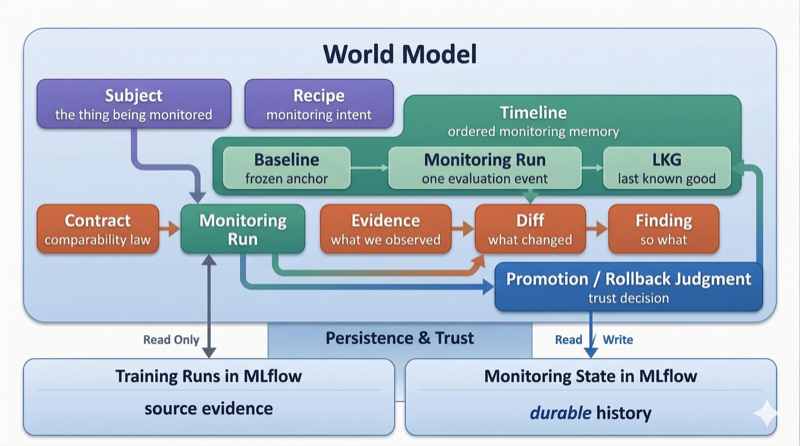
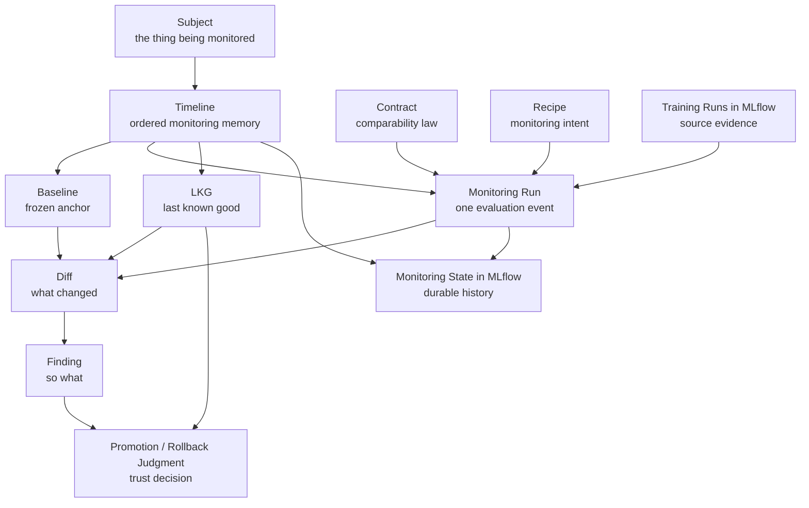

# Worldview

MLflow-Monitor starts from a simple observation:

tracking model training is not the same thing as monitoring model evolution.

MLflow is already good at remembering what happened during training. It records runs, parameters, metrics, artifacts, and experiment history. That is essential infrastructure. But it does not, by itself, help us answer the questions that come up once a team starts relying on a model over time:

- What is the reference point we actually trust?
- Are these runs even comparable before we start comparing metrics?
- What changed relative to the baseline, the previous state, or the last state we still trust?
- What should we do when the answer is not just "better" or "worse," but "not comparable"?

Those are not experiment-tracking questions. They are monitoring questions.

MLflow-Monitor tries to give those questions a proper home.

## A Better Mental Model For Monitoring

A lot of ad hoc ML monitoring starts too late in the reasoning chain. We jump straight to deltas, charts, or side-by-side metrics, then try to infer meaning after the fact. That tends to be backwards.

We think a more useful monitoring system follows a stronger order of operations:

1. establish a durable reference point
2. determine whether comparison is valid
3. produce evidence about what changed
4. interpret that evidence into action or restraint
5. preserve the result as part of the model's history

That ordering is the core design intuition behind MLflow-Monitor.

It is why the system is baseline-aware. It is why comparability comes before metric interpretation. It is why evidence and interpretation are separate layers. It is why monitoring state needs its own memory instead of being collapsed back into the original training runs.

## The World Model

  

The system is easiest to understand as a set of first-class citizens
that work together. The diagram below captures the canonical conceptual map
between them.

This is not just a data-flow diagram. It is the system's conceptual universe. Some of these ideas are already active in the current runtime. Others belong to the broader design direction. They are all part of one coherent system.

## Core Concepts

**Subject** is the stable thing we believe we are monitoring. Not a single run, not a model version. The subject is the identity that persists across retraining cycles.

**Timeline** is the ordered memory of a subject over time. A single run in isolation tells us almost nothing about model evolution. Monitoring is inherently temporal, and what matters is not only how one run performed but how the subject is moving: relative to the baseline, relative to the immediately previous state, relative to the last trusted state. The timeline is the unit of memory that turns a pile of runs into a trajectory.

**Baseline** is the frozen anchor that makes comparison meaningful. In a looser monitoring setup, the baseline is whatever somebody happens to compare against that day. In a more deliberate setup, the baseline is a conscious choice: the pinned reference that keeps comparisons from drifting, that preserves what "good" meant at the moment of decision, and that makes historical auditability possible.

**Contract** is the law of comparability. It addresses a question that many ML systems leave implicit: under what conditions is comparison valid? The contract governs whether schema changes, feature identity, data scope, or environment context invalidate a comparison before metrics are ever examined. And it produces a machine-readable outcome (`pass`, `warn`, `fail`), not a vague feeling. A workflow can succeed while still declaring that the comparison should be treated with caution or blocked entirely.

**Recipe** is where monitoring intent lives. In the broader design, it defines how the system should bind inputs, contracts, metrics, references, and output preferences into one versioned execution shape. Recipe is not just configuration syntax. It gives us a way to express monitoring intent declaratively, ties runs to the monitoring configuration that produced them, and keeps customization separate from the core semantics of the monitoring world.

**Evidence** is what the system actually observed. Metrics, environment state, schema shape, feature identity, data scope: these are the raw materials of monitoring. Evidence is collected before any interpretation happens, and the design aims to keep that evidence inspectable instead of collapsing it immediately into a verdict. The principle is straightforward: if we cannot show what we saw, we cannot defend what we concluded.

**Diff** answers "what changed?" It compares evidence across reference points (baseline, previous run, LKG) and produces structured, machine-readable deltas. Diff is not interpretation. It is the factual record of movement.

**Finding** answers "so what should we do about it?" Findings interpret diffs through the lens of policy, thresholds, and domain context. The separation between diff and finding matters because it preserves auditability. When evidence and interpretation are fused too early, we lose the ability to inspect what the system actually observed, and subjective policy can be mistaken for raw fact.

**LKG** (last known good) is the most recent state the monitoring layer still trusts. It is not just "the last successful run." It is useful in two directions: forward-looking (should this new state become the trusted one?) and backward-looking (if something goes wrong, what is the last state we can confidently return to?). A model may be in production without being the active LKG. A model may be the LKG without yet being deployed. Those are different decisions, and keeping that distinction clear matters in real ML systems.

## Why These Concepts Need To Be First-Class

The central design choice in MLflow-Monitor is treating monitoring as more than "just another report" hanging off training runs.

The system gives names and durable structure to ideas that teams already use informally: "this is our baseline," "this run is not really comparable," "this model is still the last one we trust," "the numbers changed, but that doesn't mean the same thing changed."

These are not edge cases or implementation details. They are the real semantics of model monitoring. That is why we treat them as first-class citizens instead of leaving them buried in notebooks or scattered CI logic.

## Monitoring State Should Not Pollute Training State

Training runs and monitoring runs are related, but they are not the same kind of truth.

Training state tells us how a model was produced. Monitoring state tells us how that model was evaluated within an evolving timeline. Collapsing those into one record tends to weaken the system: training history becomes polluted with monitoring-specific bookkeeping, monitoring memory becomes harder to query and reason about, and read-only treatment of source training runs becomes harder to enforce.

That is why MLflow-Monitor writes its own monitoring history to a separate MLflow namespace. The design is intentionally additive: keep MLflow as the source of training truth, and layer monitoring semantics on top.

## Traceability And Auditability

Well-designed ML systems do not just produce conclusions. They make those conclusions inspectable after the fact.

That matters for engineering review when we need to understand why a model was promoted or held back. It matters for incident investigation when something goes wrong in production and the question is "what did we know, and when did we know it?" It matters for organizational trust when stakeholders outside the ML team need confidence that model decisions are grounded in evidence rather than intuition. And it can matter for compliance and governance when auditors or internal policies ask for a defensible chain of reasoning.

The combination of timeline, baseline, recipe, contract, evidence, and monitoring state creates that chain. For any monitoring run, the system should let us show: which subject was monitored, which baseline was pinned, which training run was evaluated, which contract governed comparability, which recipe shaped execution intent, what result was produced, and what state the system trusted before and after. In the current runtime, that traceability is strongest around references, lifecycle, comparability, and persisted run outputs; the broader evidence-first model is the design direction.

MLflow-Monitor does not claim to solve compliance on its own. But explicit references, versioned intent, durable outputs, and inspectable monitoring history put a team in a better position than ad hoc notebooks, tribal memory, or scattered CI artifacts tend to offer.

## Current Runtime

Today's shipped runtime covers the early synchronous monitoring path: create, prepare, and check. That means the current implementation already provides explicit first-run baseline bootstrap, baseline reuse on later runs, comparability outcomes of `pass`, `warn`, and `fail`, and persisted monitoring runs and result artifacts in MLflow.

The broader world described here is larger than today's runtime surface. That is intentional. This document describes the design universe that shaped our architectural decisions, while being honest that concepts like diff, finding, and promotion are design direction rather than fully exposed behavior today.

This is an early alpha, not a toy.

## Read Next

- [README.md](../README.md) for the short project entrypoint
- [architecture.md](architecture.md) for runtime structure and persistence boundaries
- [demo/README.md](../demo/README.md) for the runnable local walkthrough
